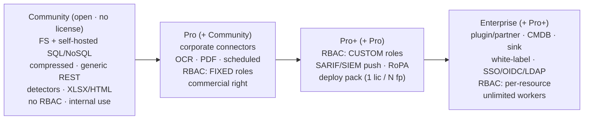
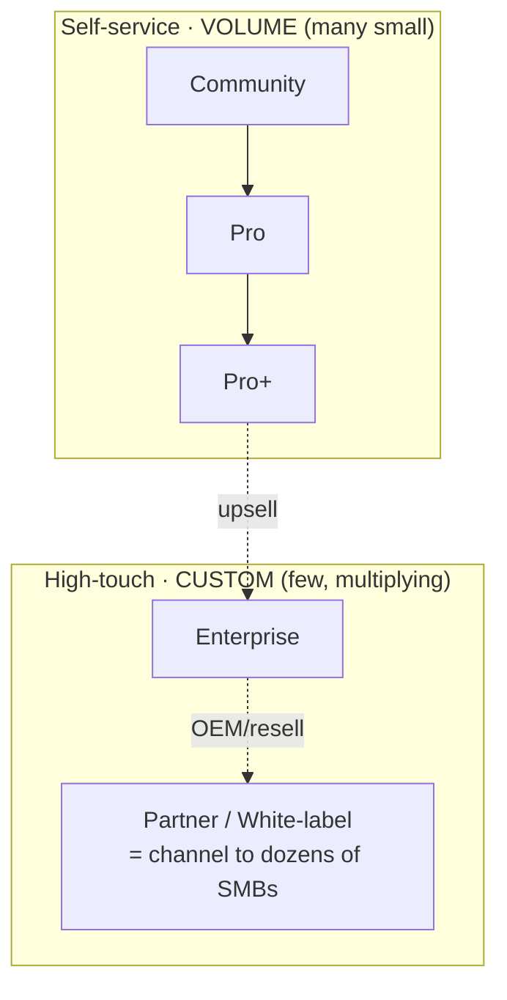

# Data Boar Subscription Tiers

**Português (Brasil):** [SUBSCRIPTION_TIERS.pt_BR.md](SUBSCRIPTION_TIERS.pt_BR.md)

Data Boar follows an **open-core** model inspired by projects like [Bitwarden](https://bitwarden.com/pricing/) and [NetSpot](https://www.netspotapp.com/pt/netspotpro.html):
a fully functional open core available to all, with commercial tiers that unlock advanced capabilities and commercial-use rights.

> **Note:** Exact pricing, availability dates, and feature assignments per tier are determined by the product team.
> This page is a structural overview only. For current pricing, contact the maintainer or see the website (when available).

## License split (open core vs commercial modules)

- **Core = open source (BSD 3-Clause, see `LICENSE`):** scanner engine, detectors, plugin interface, baseline CLI/API/dashboard, research material. **The core never closes — by definition.**
- **Commercial modules = source-available (model):** corporate features (corporate connectors, custom RBAC, SIEM/RoPA push, deploy packs, partner architecture) stay **visible and auditable** in the public repository; **commercial production use requires a paid subscription**. The physical split and the commercial license text await maintainer ratification — see [LICENSE_FAQ.md](LICENSE_FAQ.md) and [TERMS_OF_USE.md](../TERMS_OF_USE.md).

## Master principle: tier = capability, claim = quantity

- **TIER = CAPABILITY** — what your deployment can do (connectors, RBAC depth, push/export paths).
- **CLAIM = QUANTITY** — how much (workers, deployments, rows); a signed JWT claim wins over the tier default and only bites in `licensing.mode: enforced`.
- New bands exist only for a **capability jump** — never for a number alone.

## Tier ladder (additive open-core model)

## Two go-to-market motions

## Tier overview

| Tier | Intended audience | License token | Key differentiator |
|---|---|---|---|
| **Community** | Internal DPOs, researchers, students, individual use | Not required (open mode) | Full open-core functionality; no cost |
| **Trial / POC** | Pre-sales evaluations, proof-of-concept | Time-limited signed token | Row-capped report; watermarked; converts to Pro/Pro+ |
| **Pro / Consultant** | Independent consultants, solo MSSPs, single-org buyers | Annual signed token | Commercial delivery right; corporate connectors; fixed RBAC roles |
| **Pro+** | Teams needing custom RBAC, SIEM/GRC integration, multi-footprint packs | Annual signed token (claim-driven) | Custom RBAC roles; SARIF/SIEM push; RoPA export; deploy pack |
| **Enterprise** | Large organisations, regulated industries, OEM | Custom enterprise agreement | Plugin/partner arch + CMDB + sink + white-label + SSO/LDAP + per-resource RBAC |
| **Partner** (custom) | System integrators, MSPs, multi-client resellers | Custom org agreement | Multi-client delivery; co-brand/white-label channel to many SMBs |

## Capability per band (the truth table)

| Capability | Community | Pro | Pro+ | Enterprise |
|---|:---:|:---:|:---:|:---:|
| FS + self-hosted SQL/NoSQL + generic REST | ✅ | ✅ | ✅ | ✅ |
| Corporate connectors (PowerBI/SharePoint/…) | — | ✅ | ✅ | ✅ |
| RBAC | — (global API key) | **fixed** roles | **custom** roles | **per-resource + SSO/LDAP** |
| SARIF/SIEM push · RoPA export | — | — | ✅ | ✅ |
| Plugin/partner arch · CMDB · sink | — | — | — | ✅ |
| White-label · SSO/OIDC | — | — | — | ✅ |
| Commercial delivery right | — | ✅ | ✅ | ✅ |

### Detection depth and formats (licensed tiers)

- **Detection depth:** ML/DL heuristics, confidence calibration, and advanced FN-reduction are **Pro or higher**.
- **File formats:** legacy office suites (WordPerfect, Access, OneNote), binary string extraction, and **browser artefacts** are **Pro or higher** — surveillance-adjacent paths additionally require runtime operator acknowledgment per [TERMS_OF_USE.md §5](../TERMS_OF_USE.md).
- **Reports/governance:** audit trail and compliance evidence mapping (GRC-ready) deepen at **Pro+ / Enterprise**.

## Claims (quantity — claim-driven; tier default = fallback)

Workers are, in practice, the number of **targets scanned concurrently**.

| Claim | Community | Pro | Pro+ | Enterprise |
|---|:---:|:---:|:---:|:---:|
| `dbmax_workers` (≈ concurrent targets) | 2 | 4 | **8** | **unlimited** |
| `dbmax_deployments` | 1 | 2 | 5 (pack) | unlimited |

- Unlimited workers = **Enterprise only** (the ceiling is the Enterprise hook).
- The Pro+ **deploy pack** (1 license / N fingerprints) is an **admin convenience** — one license and one invoice for N footprints, priced **~linearly**; it is **not** a whale discount.
- Ratified ladder (2026-06-11) — runtime defaults in `core/licensing/guard.py`; claims in [LICENSING_SPEC.md](LICENSING_SPEC.md).

## What a subscription includes

A paid subscription is **not just feature gates**. It includes:

- **Standard support** channel (SLA depth grows with the tier).
- **Configuration assistance** — getting targets, connectors, and scan profiles right for your environment.
- **Productized customization** — tailoring within the product surface (profiles, report shaping, connector configuration) as packaged services, distinct from bespoke professional services.

## Enforcement model

Tiers are enforced via **signed Ed25519 JWT licence tokens** (see [`LICENSING_SPEC.md`](LICENSING_SPEC.md)).
The open-core Community tier runs without a token (`licensing.mode: open`).
Claims only bite in `licensing.mode: enforced`; a signed claim wins over the tier default.

## Contact

To evaluate a Trial or enquire about Pro/Pro+/Partner/Enterprise pricing, open an issue or contact the maintainer directly.

---

*See also: [`LICENSE_FAQ.md`](LICENSE_FAQ.md) for the licensing FAQ, [`LICENSING_OPEN_CORE_AND_COMMERCIAL.md`](LICENSING_OPEN_CORE_AND_COMMERCIAL.md) for the open-core policy and brand IP inventory, and [`TERMS_OF_USE.md`](../TERMS_OF_USE.md) for acceptable use.*
