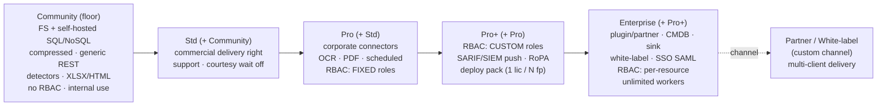
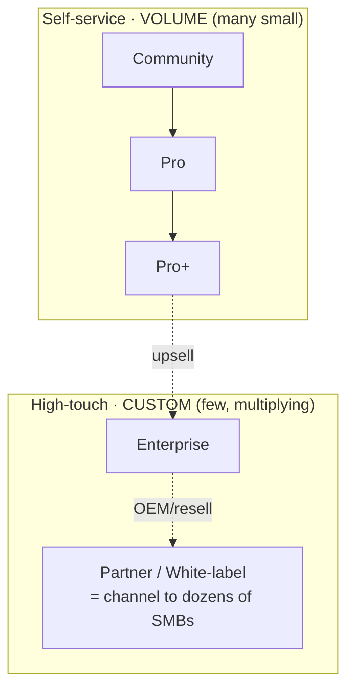

# Data Boar subscription bands (canonical)

**Português (Brasil):** [SUBSCRIPTION_TIERS.pt_BR.md](SUBSCRIPTION_TIERS.pt_BR.md)

This is the **canonical public description of product bands** (capability ladder). It is **not** a price list. The live site still says pricing is coming soon; amounts, discounts, volume/franchise quotes, and commercial program names stay in private commercial evaluation (`docs/private/`) until product and counsel freeze them.

**Code truth:** `Tier` + `FEATURE_TIER_MAP` + `_TIER_ORDER` in `core/licensing/tier_features.py`; JWT / lab string mapping in `core/licensing/runtime_feature_tier.py`. When those change, update **this** file in the same PR — do not add a fourth near-duplicate page.

JWT claim mechanics: [LICENSING_SPEC.md](LICENSING_SPEC.md). Open-core policy and brand IP (no second ladder): [LICENSING_OPEN_CORE_AND_COMMERCIAL.md](LICENSING_OPEN_CORE_AND_COMMERCIAL.md). How to run: [USAGE.md](USAGE.md).

## Two axes (do not collapse)

| Axis | Question | What is public |
| ---- | -------- | -------------- |
| **Capability (band)** | What can this deployment do? | The six bands below. |
| **Quantity (claims)** | How much concurrency / how many licensed sites? | Shipped JWT claims (`dbmax_workers`, `dbmax_deployments`). **Estate-size franchises** (logical active scope, not bytes-read-per-scan) remain **private evaluation** — inventory of estate **size** can still be a product feature without being a bill. Raising volume **must not** silently promote Pro → Pro+ / Enterprise. |

Data Boar follows an **open-core** model: a fully functional open core, with commercial bands that unlock advanced capabilities and commercial-use rights. Open-core **policy** is in [LICENSING_OPEN_CORE_AND_COMMERCIAL.md](LICENSING_OPEN_CORE_AND_COMMERCIAL.md) — not restated here.

> **Naming:** **Boar Std** (tier token `std`) is the Data Boar commercial entry band — it is **not** Oracle Database Standard Edition or any other vendor "Standard" SKU.

## Six product bands (not seven)

The commercial ladder is **six** additive bands. `_TIER_ORDER` ordinals: Community **0** → Std **1** → Pro **2** → Pro+ **3** → Enterprise **4** → Partner **5**.

`Tier.OPEN` is **not** a customer-facing band. It is an **enforcement-off sentinel** (ordinal **99**, hardcoded bypass in `is_feature_available`) used for default **dev / CI / unlicensed** `licensing.mode: open`. Empty `dbtier` / lab `effective_tier` maps to that sentinel. Fail-closed enforced mode caps to **Community**, never to Open.

**Trial** is a JWT string (`trial`) that **maps to Pro** in `map_dbtier_string_to_tier` — not a seventh band.

Partner / white-label SKU strings (`partner`, `whitelabel`, `white_label`, `partner_custom`) map to enum **`partner`**. In `_TIER_ORDER`, Partner sits **above** Enterprise, so a Partner token currently receives **all** mapped feature keys (including Enterprise). White-label is an **alias of Partner**, not a separate enum.

```mermaid
flowchart LR
    C["Community (floor)<br/>FS + self-hosted SQL/NoSQL<br/>compressed · generic REST<br/>detectors · XLSX/HTML<br/>no RBAC · internal use"]
    S["Std (+ Community)<br/>commercial delivery right<br/>support · courtesy wait off"]
    P["Pro (+ Std)<br/>corporate connectors<br/>OCR · PDF · scheduled<br/>RBAC: FIXED roles"]
    PP["Pro+ (+ Pro)<br/>RBAC: CUSTOM roles<br/>SARIF/SIEM push · RoPA<br/>deploy pack (1 lic / N fp)"]
    E["Enterprise (+ Pro+)<br/>plugin/partner · CMDB · sink<br/>white-label · SSO SAML<br/>RBAC: per-resource<br/>unlimited workers"]
    PT["Partner / White-label<br/>(custom channel)<br/>multi-client delivery"]
    C --> S --> P --> PP --> E
    E -. channel .-> PT
```

## Two go-to-market motions

```mermaid
flowchart TB
    subgraph V["Self-service · VOLUME (many small)"]
      C2[Community] --> P2[Pro] --> PP2["Pro+"]
    end
    subgraph H["High-touch · CUSTOM (few, multiplying)"]
      E2[Enterprise]
      PT2["Partner / White-label<br/>= channel to dozens of SMBs"]
    end
    PP2 -. upsell .-> E2
    E2 -. OEM/resell .-> PT2
```

## Band overview

| Band | Intended audience | License token | Key differentiator |
|---|---|---|---|
| **Community** | Internal DPOs, researchers, students, individual use | Not required (`licensing.mode: open`) | Full open-core functionality |
| **Std** | Small teams buying commercial rights before full Pro connectors | Annual signed token | Commercial delivery right; support; **no courtesy upgrade wait** (Boar-Std — not Oracle DB Standard Edition). **No extra `FEATURE_TIER_MAP` keys** vs Community |
| **Pro / Consultant** | Independent consultants, solo MSSPs, single-org buyers | Annual signed token | Corporate connectors; fixed RBAC roles. JWT `trial` maps here |
| **Pro+** | Teams needing custom RBAC, SIEM/GRC integration, multi-footprint packs | Annual signed token (claim-driven) | Custom RBAC roles; SARIF/SIEM push; RoPA export; deploy pack |
| **Enterprise** | Large organisations, regulated industries, OEM | Custom enterprise agreement | Plugin/partner arch + CMDB + sink + white-label + `sso_saml` + per-resource RBAC |
| **Partner** (custom) | System integrators, MSPs, multi-client resellers | Custom org agreement | Multi-client delivery; co-brand/white-label channel. Capability ≥ Enterprise in `_TIER_ORDER` |

## JWT / lab aliases (code)

Unknown strings fail closed to **Community** when mapped.

| Band | Typical `dbtier` / `effective_tier` strings |
| ---- | ------------------------------------------- |
| Community | `community`, `oss`, `open_core` |
| Std | `std`, `standard`, `boar_std`, `boar-std` |
| Pro | `pro`, `professional`, `consultant`; **`trial` maps here** |
| Pro+ | `pro_plus`, `pro+`, `proplus` |
| Enterprise | `enterprise`, `ent` |
| Partner / white-label SKU | `partner`, `partner_custom`, `whitelabel`, `white_label` → enum **`partner`** |
| Enforcement off (not a SKU) | empty string in open mode → `Tier.OPEN` |

## Capability groups (`FEATURE_TIER_MAP`)

A cell is **Yes** when that band’s enum is **≥** the feature’s minimum in `_TIER_ORDER`. **Std** has **no unique feature keys**.

| Capability group | Community | Std | Pro | Pro+ | Ent | Partner / WL |
| ---------------- | :-------: | :-: | :-: | :--: | :-: | :----------: |
| Filesystem; self-hosted SQL/NoSQL; generic REST/API; core detectors; compressed files; content-type; synthetic testing; XLSX/HTML; REST API; dashBOARd; Docker/Ansible keys | Yes | Yes | Yes | Yes | Yes | Yes |
| OCR; PDF report; compliance-grade report; scheduled scans; dashboard RBAC; API-key UI; maturity POC; notifications; SBOM; build-integrity; SQL findings sink; Pro governance lens; managed/corporate connectors | — | — | Yes | Yes | Yes | Yes |
| `pro_prefilter_accel`; `rust_regex_stage` | — | — | — | Yes | Yes | Yes |
| Custom PDF branding; Ent scheduler UI; Ent governance lens; multi-tenant; **SSO SAML**; PDF digital signature; scheduled PDF email; historical comparison; audit-log export; custom detectors; VCS connector; plugin/partner interface; partner provider driver; remediation plugin/manifest | — | — | — | — | Yes | Yes |

**Not in `FEATURE_TIER_MAP` (do not invent):** JSONL report key; OIDC/LDAP SSO (named elsewhere as **intent**); dedicated-support SLAs.

### Detection depth and formats (licensed bands)

- **Detection depth:** ML/DL heuristics, confidence calibration, and advanced FN-reduction are **Pro or higher**.
- **File formats:** legacy office suites (WordPerfect, Access, OneNote), binary string extraction, and **browser artefacts** are **Pro or higher** — surveillance-adjacent paths additionally require runtime operator acknowledgment per [TERMS_OF_USE.md §5](../TERMS_OF_USE.md).
- **Reports/governance:** audit trail and compliance evidence mapping (GRC-ready) deepen at **Pro+ / Enterprise**.

## Claims (quantity — claim-driven; band default = fallback)

Workers are, in practice, the number of **targets scanned concurrently**. Caps bite only in `licensing.mode: enforced`. These are **entitlement claims**, not prices.

| Claim | Community | Std | Pro | Pro+ | Enterprise |
|---|:---:|:---:|:---:|:---:|:---:|
| `dbmax_workers` (≈ concurrent targets) | 2 | 2 (same floor as Community unless a signed claim raises it) | 4 | **8** (issued tokens carry the claim) | **unlimited** |
| `dbmax_deployments` | 1 | (commercial right; site count follows the signed claim / contract) | 2 | 5 (pack) | unlimited |

- Unlimited workers = **Enterprise** entitlement (Partner follows `_TIER_ORDER` / contract).
- The Pro+ **deploy pack** (1 license / N fingerprints) is **admin convenience** — one license for N footprints — **not** a volume discount schedule.
- Runtime defaults: `core/licensing/guard.py`. Claim names: [LICENSING_SPEC.md](LICENSING_SPEC.md). `dbmax_targets` remains a planned claim.

## License split (open core vs commercial modules)

- **Core = open source (BSD 3-Clause, see `LICENSE`):** scanner engine, detectors, plugin interface, baseline CLI/API/dashboard, research material. **The core never closes — by definition.**
- **Commercial modules = source-available (model):** corporate features stay **visible and auditable** in the public repository; **commercial production use requires a paid subscription**. Physical split and commercial license text await maintainer ratification — see [LICENSE_FAQ.md](LICENSE_FAQ.md) and [TERMS_OF_USE.md](../TERMS_OF_USE.md).

## What a paid subscription includes

A paid subscription is **not just feature gates**. It includes:

- **Standard support** channel (SLA depth grows with the band).
- **Configuration assistance** — getting targets, connectors, and scan profiles right for your environment.
- **Productized customization** — tailoring within the product surface (profiles, report shaping, connector configuration) as packaged services, distinct from bespoke professional services.

## Enforcement model

Bands are enforced via **signed Ed25519 JWT licence tokens** (see [LICENSING_SPEC.md](LICENSING_SPEC.md)).
Community open-core runs without a token (`licensing.mode: open` → Open sentinel, not a SKU).
Claims only bite in `licensing.mode: enforced`; a signed claim wins over the band default.

## Contact

**contact@databoar.com.br** or a GitHub issue. This page is not a quote and does not publish amounts.

---

*See also: [LICENSE_FAQ.md](LICENSE_FAQ.md), [LICENSING_OPEN_CORE_AND_COMMERCIAL.md](LICENSING_OPEN_CORE_AND_COMMERCIAL.md), [TERMS_OF_USE.md](../TERMS_OF_USE.md).*
