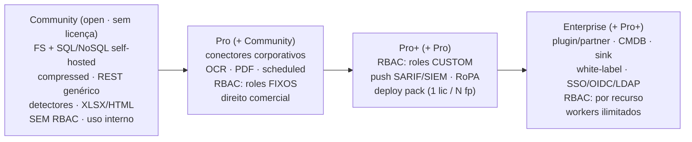
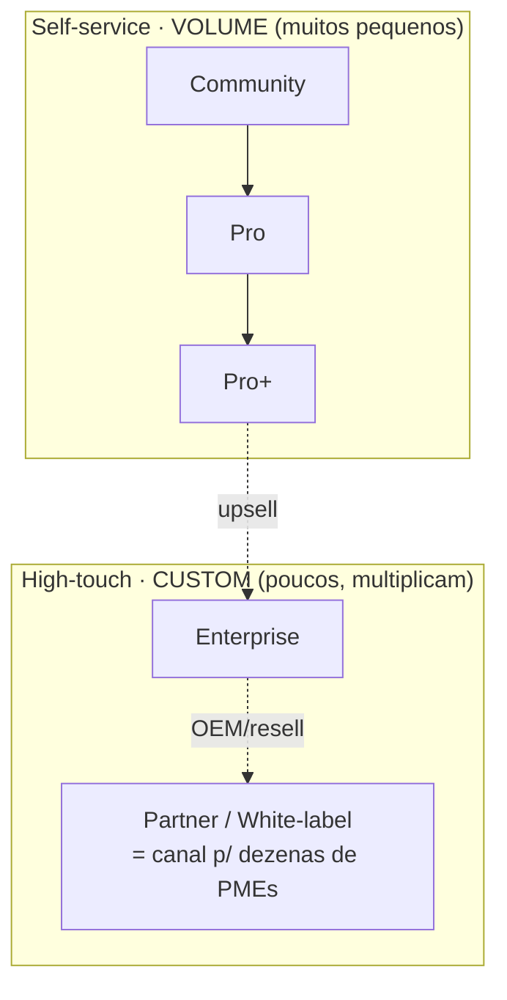

# Camadas de assinatura do Data Boar

**English:** [SUBSCRIPTION_TIERS.md](SUBSCRIPTION_TIERS.md)

O Data Boar segue o modelo **open-core**, inspirado em projetos como [Bitwarden](https://bitwarden.com/pricing/) e [NetSpot](https://www.netspotapp.com/pt/netspotpro.html):
um núcleo totalmente funcional disponível a todos, com camadas comerciais que desbloqueiam capacidades avançadas e direitos de uso comercial.

> **Nota:** Preços exatos, datas de disponibilidade e atribuição de funcionalidades por camada são definidos pela equipe de produto.
> Esta página é apenas uma visão estrutural. Para preços atuais, entre em contato com o mantenedor ou consulte o site (quando disponível).

## Divisão de licença (open core vs módulos comerciais)

- **Core = open source (BSD 3-Clause, veja `LICENSE`):** engine de varredura, detectores, interface de plugin, CLI/API/dashboard base, material de pesquisa. **O core nunca fecha — por definição.**
- **Módulos comerciais = source-available (modelo):** funcionalidades corporativas (conectores corporativos, RBAC custom, push SIEM/RoPA, deploy packs, arquitetura de parceiros) permanecem **visíveis e auditáveis** no repositório público; **uso comercial em produção exige assinatura paga**. A divisão física e o texto da licença comercial aguardam ratificação do mantenedor — veja [LICENSE_FAQ.pt_BR.md](LICENSE_FAQ.pt_BR.md) e [TERMS_OF_USE.pt_BR.md](../TERMS_OF_USE.pt_BR.md).

## Princípio mestre: tier = capacidade, claim = quantidade

- **TIER = CAPACIDADE** — o que o seu deployment pode fazer (conectores, profundidade de RBAC, caminhos de push/export).
- **CLAIM = QUANTIDADE** — quanto (workers, deployments, linhas); um claim JWT assinado vence o padrão da camada e só atua em `licensing.mode: enforced`.
- Banda nova só existe por **salto de capacidade** — nunca por um número isolado.

## Escada de camadas (modelo aditivo open-core)

## Dois movimentos de go-to-market

## Visão geral das camadas

| Camada | Público-alvo | Token de licença | Diferencial principal |
|---|---|---|---|
| **Community** | DPOs internos, pesquisadores, estudantes, uso individual | Não exigido (modo open) | Funcionalidade completa do open-core; sem custo |
| **Trial / POC** | Avaliações pré-vendas, prova de conceito | Token assinado com prazo | Relatório com limite de linhas; marca d'água; converte para Pro/Pro+ |
| **Pro / Consultor** | Consultores independentes, MSSPs individuais, compradores de organização única | Token anual assinado | Direito de entrega comercial; conectores corporativos; roles RBAC fixos |
| **Pro+** | Times que precisam de RBAC custom, integração SIEM/GRC, packs multi-footprint | Token anual assinado (claim-driven) | Roles RBAC custom; push SARIF/SIEM; export RoPA; deploy pack |
| **Enterprise** | Grandes organizações, setores regulados, OEM | Acordo empresarial personalizado | Arquitetura plugin/partner + CMDB + sink + white-label + SSO/LDAP + RBAC por recurso |
| **Partner** (custom) | Integradores, MSPs, revendedores multi-cliente | Acordo organizacional custom | Entrega multi-cliente; canal co-marca/white-label para muitas PMEs |

## Capacidade por banda (a tabela de verdade)

| Capacidade | Community | Pro | Pro+ | Enterprise |
|---|:---:|:---:|:---:|:---:|
| FS + SQL/NoSQL self-hosted + REST genérico | ✅ | ✅ | ✅ | ✅ |
| Conectores corporativos (PowerBI/SharePoint/…) | — | ✅ | ✅ | ✅ |
| RBAC | — (API key global) | roles **fixos** | roles **custom** | **por recurso + SSO/LDAP** |
| Push SARIF/SIEM · export RoPA | — | — | ✅ | ✅ |
| Arquitetura plugin/partner · CMDB · sink | — | — | — | ✅ |
| White-label · SSO/OIDC | — | — | — | ✅ |
| Direito de entrega comercial | — | ✅ | ✅ | ✅ |

### Profundidade de detecção e formatos (camadas licenciadas)

- **Profundidade de detecção:** heurísticas ML/DL, calibração de confiança e redução avançada de falsos negativos são **Pro ou superior**.
- **Formatos de arquivo:** suites de escritório legadas (WordPerfect, Access, OneNote), extração de strings binárias e **artefatos de browser** são **Pro ou superior** — caminhos adjacentes a vigilância exigem ainda confirmação do operador em runtime conforme [TERMS_OF_USE.pt_BR.md §5](../TERMS_OF_USE.pt_BR.md).
- **Relatórios/governança:** trilha de auditoria e mapeamento de evidências de compliance (GRC-ready) se aprofundam em **Pro+ / Enterprise**.

## Claims (quantidade — claim-driven; padrão da camada = fallback)

Workers são, na prática, o número de **alvos varridos simultaneamente**.

| Claim | Community | Pro | Pro+ | Enterprise |
|---|:---:|:---:|:---:|:---:|
| `dbmax_workers` (≈ alvos simultâneos) | 2 | 4 | **8** | **ilimitado** |
| `dbmax_deployments` | 1 | 2 | 5 (pack) | ilimitado |

- Workers ilimitados = **só Enterprise** (o teto é o gancho do Enterprise).
- O **deploy pack** do Pro+ (1 licença / N fingerprints) é **conveniência de administração** — uma licença e uma fatura para N footprints, com preço **~linear**; **não** é desconto de baleia.
- Escada ratificada (2026-06-11) — padrões de runtime em `core/licensing/guard.py`; claims em [LICENSING_SPEC.md](LICENSING_SPEC.md).

## O que a assinatura inclui

A assinatura paga **não é só feature gate**. Ela inclui:

- Canal de **suporte padrão** (profundidade de SLA cresce com a camada).
- **Assistência de configuração** — acertar alvos, conectores e perfis de varredura para o seu ambiente.
- **Customização produtizada** — ajustes dentro da superfície do produto (perfis, formato de relatório, configuração de conectores) como serviços empacotados, distintos de serviços profissionais sob medida.

## Modelo de aplicação

As camadas são aplicadas via **tokens de licença JWT assinados com Ed25519** (veja [`LICENSING_SPEC.md`](LICENSING_SPEC.md)).
A camada Community de open-core funciona sem token (`licensing.mode: open`).
Claims só atuam em `licensing.mode: enforced`; um claim assinado vence o padrão da camada.

## Contato

Para avaliar um Trial ou consultar preços Pro/Pro+/Partner/Enterprise, abra uma issue ou entre em contato diretamente com o mantenedor.

---

*Veja também: [`LICENSE_FAQ.pt_BR.md`](LICENSE_FAQ.pt_BR.md) para o FAQ de licenciamento, [`LICENSING_OPEN_CORE_AND_COMMERCIAL.md`](LICENSING_OPEN_CORE_AND_COMMERCIAL.md) para a política open-core e inventário de propriedade intelectual da marca, e [`TERMS_OF_USE.pt_BR.md`](../TERMS_OF_USE.pt_BR.md) para uso aceitável.*
