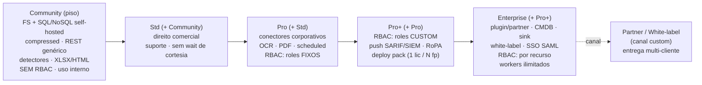
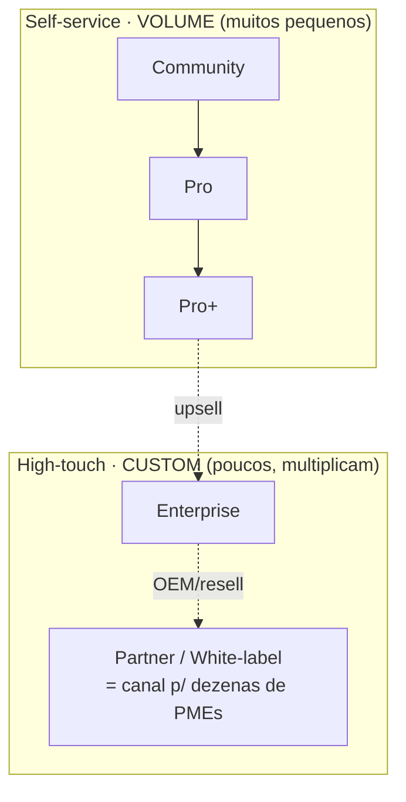

# Camadas de assinatura do Data Boar (canônico)

**English:** [SUBSCRIPTION_TIERS.md](SUBSCRIPTION_TIERS.md)

Esta é a **descrição pública canônica das faixas de produto** (escada de capacidade). **Não** é lista de preços. O site ao vivo ainda diz que precificação vem em breve; valores, descontos, cotações de volume/franquia e nomes de programas comerciais ficam na avaliação comercial privada (`docs/private/`) até produto e jurídico congelarem.

**Verdade no código:** `Tier` + `FEATURE_TIER_MAP` + `_TIER_ORDER` em `core/licensing/tier_features.py`; mapeamento JWT / lab em `core/licensing/runtime_feature_tier.py`. Quando isso mudar, atualize **este** arquivo no mesmo PR — não crie uma quarta página quase duplicada.

Mecânica de claims JWT: [LICENSING_SPEC.pt_BR.md](LICENSING_SPEC.pt_BR.md). Política open-core e IP da marca (sem segunda escada): [LICENSING_OPEN_CORE_AND_COMMERCIAL.pt_BR.md](LICENSING_OPEN_CORE_AND_COMMERCIAL.pt_BR.md). Como rodar: [USAGE.pt_BR.md](USAGE.pt_BR.md).

## Dois eixos (não colapsar)

| Eixo | Pergunta | O que é público |
| ---- | -------- | --------------- |
| **Capacidade (faixa)** | O que este deployment pode fazer? | As seis faixas abaixo. |
| **Quantidade (claims)** | Quanta concorrência / quantos sites licenciados? | Claims JWT já embarcados (`dbmax_workers`, `dbmax_deployments`). **Franquias de tamanho de estate** (escopo lógico ativo, não bytes lidos por scan) continuam **avaliação privada** — inventariar o **tamanho** do estate ainda pode ser capacidade de produto sem ser fatura. Aumentar volume **não** deve promover em silêncio Pro → Pro+ / Enterprise. |

O Data Boar segue o modelo **open-core**: núcleo funcional aberto, com faixas comerciais que desbloqueiam capacidades avançadas e direitos de uso comercial. A **política** open-core está em [LICENSING_OPEN_CORE_AND_COMMERCIAL.pt_BR.md](LICENSING_OPEN_CORE_AND_COMMERCIAL.pt_BR.md) — não é reiterada aqui.

> **Nomenclatura:** **Boar Std** (token `std`) é a faixa comercial de entrada do Data Boar — **não** é Oracle Database Standard Edition nem outro SKU "Standard" de terceiros.

## Seis faixas de produto (não sete)

A escada comercial tem **seis** faixas aditivas. Ordinais em `_TIER_ORDER`: Community **0** → Std **1** → Pro **2** → Pro+ **3** → Enterprise **4** → Partner **5**.

`Tier.OPEN` **não** é faixa voltada ao cliente. É um **sentinela de enforcement desligado** (ordinal **99**, bypass hardcoded em `is_feature_available`) usado no padrão **dev / CI / sem licença** (`licensing.mode: open`). `dbtier` / `effective_tier` vazio mapeia para esse sentinela. Fail-closed em modo enforced limita a **Community**, nunca a Open.

**Trial** é string JWT (`trial`) que **mapeia para Pro** em `map_dbtier_string_to_tier` — não é sétima faixa.

Strings Partner / white-label (`partner`, `whitelabel`, `white_label`, `partner_custom`) mapeiam para o enum **`partner`**. Em `_TIER_ORDER`, Partner fica **acima** de Enterprise, então um token Partner hoje recebe **todas** as chaves mapeadas (incluindo Enterprise). White-label é **alias de Partner**, não um sétimo enum.

```mermaid
flowchart LR
    C["Community (piso)<br/>FS + SQL/NoSQL self-hosted<br/>compressed · REST genérico<br/>detectores · XLSX/HTML<br/>SEM RBAC · uso interno"]
    S["Std (+ Community)<br/>direito comercial<br/>suporte · sem wait de cortesia"]
    P["Pro (+ Std)<br/>conectores corporativos<br/>OCR · PDF · scheduled<br/>RBAC: roles FIXOS"]
    PP["Pro+ (+ Pro)<br/>RBAC: roles CUSTOM<br/>push SARIF/SIEM · RoPA<br/>deploy pack (1 lic / N fp)"]
    E["Enterprise (+ Pro+)<br/>plugin/partner · CMDB · sink<br/>white-label · SSO SAML<br/>RBAC: por recurso<br/>workers ilimitados"]
    PT["Partner / White-label<br/>(canal custom)<br/>entrega multi-cliente"]
    C --> S --> P --> PP --> E
    E -. canal .-> PT
```

## Dois movimentos de go-to-market

```mermaid
flowchart TB
    subgraph V["Self-service · VOLUME (muitos pequenos)"]
      C2[Community] --> P2[Pro] --> PP2["Pro+"]
    end
    subgraph H["High-touch · CUSTOM (poucos, multiplicam)"]
      E2[Enterprise]
      PT2["Partner / White-label<br/>= canal p/ dezenas de PMEs"]
    end
    PP2 -. upsell .-> E2
    E2 -. OEM/resell .-> PT2
```

## Visão geral das faixas

| Faixa | Público-alvo | Token de licença | Diferencial principal |
|---|---|---|---|
| **Community** | DPOs internos, pesquisadores, estudantes, uso individual | Não exigido (`licensing.mode: open`) | Funcionalidade completa do open-core |
| **Std** | Equipes pequenas que compram direito comercial antes dos conectores Pro | Token anual assinado | Direito de entrega comercial; suporte; **sem wait de cortesia** (Boar Std — não Oracle DB Standard Edition). **Sem chaves extras em `FEATURE_TIER_MAP`** vs Community |
| **Pro / Consultor** | Consultores independentes, MSSPs individuais, compradores de organização única | Token anual assinado | Conectores corporativos; roles RBAC fixos. JWT `trial` mapeia aqui |
| **Pro+** | Times que precisam de RBAC custom, integração SIEM/GRC, packs multi-footprint | Token anual assinado (claim-driven) | Roles RBAC custom; push SARIF/SIEM; export RoPA; deploy pack |
| **Enterprise** | Grandes organizações, setores regulados, OEM | Acordo empresarial personalizado | Arquitetura plugin/partner + CMDB + sink + white-label + `sso_saml` + RBAC por recurso |
| **Partner** (custom) | Integradores, MSPs, revendedores multi-cliente | Acordo organizacional custom | Entrega multi-cliente; canal co-marca/white-label. Capacidade ≥ Enterprise em `_TIER_ORDER` |

## Aliases JWT / lab (código)

Strings desconhecidas falham fechadas para **Community** no mapeamento.

| Faixa | Strings típicas `dbtier` / `effective_tier` |
| ---- | ------------------------------------------- |
| Community | `community`, `oss`, `open_core` |
| Std | `std`, `standard`, `boar_std`, `boar-std` |
| Pro | `pro`, `professional`, `consultant`; **`trial` mapeia aqui** |
| Pro+ | `pro_plus`, `pro+`, `proplus` |
| Enterprise | `enterprise`, `ent` |
| Partner / white-label SKU | `partner`, `partner_custom`, `whitelabel`, `white_label` → enum **`partner`** |
| Enforcement desligado (não é SKU) | string vazia em modo open → `Tier.OPEN` |

## Grupos de capacidade (`FEATURE_TIER_MAP`)

Uma célula é **Sim** quando o enum da faixa é **≥** o mínimo da feature em `_TIER_ORDER`. **Std** não tem chaves exclusivas.

| Grupo de capacidade | Community | Std | Pro | Pro+ | Ent | Partner / WL |
| ---------------- | :-------: | :-: | :-: | :--: | :-: | :----------: |
| Filesystem; SQL/NoSQL self-hosted; REST/API genérico; detectores core; compactados; content-type; teste sintético; XLSX/HTML; REST API; dashBOARd; chaves Docker/Ansible | Sim | Sim | Sim | Sim | Sim | Sim |
| OCR; relatório PDF; relatório compliance-grade; scans agendados; RBAC do dashboard; UI de API-key; POC de maturidade; notificações; SBOM; integridade de build; sink SQL de findings; governance lens Pro; conectores gerenciados/corporativos | — | — | Sim | Sim | Sim | Sim |
| `pro_prefilter_accel`; `rust_regex_stage` | — | — | — | Sim | Sim | Sim |
| Branding PDF custom; UI de scheduler Ent; governance lens Ent; multi-tenant; **SSO SAML**; assinatura digital de PDF; e-mail PDF agendado; comparação histórica; export de audit-log; detectores custom; conector VCS; interface plugin/partner; driver de provider parceiro; plugin/manifest de remediação | — | — | — | — | Sim | Sim |

**Fora de `FEATURE_TIER_MAP` (não inventar):** chave de relatório JSONL; SSO OIDC/LDAP (citado noutro lugar como **intenção**); SLAs de suporte dedicado.

### Profundidade de detecção e formatos (faixas licenciadas)

- **Profundidade de detecção:** heurísticas ML/DL, calibração de confiança e redução avançada de falsos negativos são **Pro ou superior**.
- **Formatos de arquivo:** suites de escritório legadas (WordPerfect, Access, OneNote), extração de strings binárias e **artefatos de browser** são **Pro ou superior** — caminhos adjacentes a vigilância exigem ainda confirmação do operador em runtime conforme [TERMS_OF_USE.pt_BR.md §5](../TERMS_OF_USE.pt_BR.md).
- **Relatórios/governança:** trilha de auditoria e mapeamento de evidências de compliance (GRC-ready) se aprofundam em **Pro+ / Enterprise**.

## Claims (quantidade — claim-driven; padrão da faixa = fallback)

Workers são, na prática, o número de **alvos varridos simultaneamente**. Os tetos só atuam em `licensing.mode: enforced`. São **claims de entitlement**, não preços.

| Claim | Community | Std | Pro | Pro+ | Enterprise |
|---|:---:|:---:|:---:|:---:|:---:|
| `dbmax_workers` (≈ alvos simultâneos) | 2 | 2 (mesmo piso da Community salvo claim assinado) | 4 | **8** (tokens emitidos carregam o claim) | **ilimitado** |
| `dbmax_deployments` | 1 | (direito comercial; contagem de sites segue o claim / contrato) | 2 | 5 (pack) | ilimitado |

- Workers ilimitados = entitlement **Enterprise** (Partner segue `_TIER_ORDER` / contrato).
- O **deploy pack** do Pro+ (1 licença / N fingerprints) é **conveniência de administração** — uma licença para N footprints — **não** é tabela de desconto por volume.
- Padrões de runtime: `core/licensing/guard.py`. Nomes de claims: [LICENSING_SPEC.pt_BR.md](LICENSING_SPEC.pt_BR.md). `dbmax_targets` continua claim planejado.

## Divisão de licença (open core vs módulos comerciais)

- **Core = open source (BSD 3-Clause, veja `LICENSE`):** engine de varredura, detectores, interface de plugin, CLI/API/dashboard base, material de pesquisa. **O core nunca fecha — por definição.**
- **Módulos comerciais = source-available (modelo):** funcionalidades corporativas permanecem **visíveis e auditáveis** no repositório público; **uso comercial em produção exige assinatura paga**. A divisão física e o texto da licença comercial aguardam ratificação do mantenedor — veja [LICENSE_FAQ.pt_BR.md](LICENSE_FAQ.pt_BR.md) e [TERMS_OF_USE.pt_BR.md](../TERMS_OF_USE.pt_BR.md).

## O que a assinatura paga inclui

A assinatura paga **não é só feature gate**. Ela inclui:

- Canal de **suporte padrão** (profundidade de SLA cresce com a faixa).
- **Assistência de configuração** — acertar alvos, conectores e perfis de varredura para o seu ambiente.
- **Customização produtizada** — ajustes dentro da superfície do produto (perfis, formato de relatório, configuração de conectores) como serviços empacotados, distintos de serviços profissionais sob medida.

## Modelo de aplicação

As faixas são aplicadas via **tokens de licença JWT assinados com Ed25519** (veja [LICENSING_SPEC.pt_BR.md](LICENSING_SPEC.pt_BR.md)).
O open-core Community roda sem token (`licensing.mode: open` → sentinela Open, não SKU).
Claims só atuam em `licensing.mode: enforced`; um claim assinado vence o padrão da faixa.

## Contato

**contact@databoar.com.br** ou uma issue no GitHub. Esta página não é orçamento e não publica valores.

---

*Veja também: [LICENSE_FAQ.pt_BR.md](LICENSE_FAQ.pt_BR.md), [LICENSING_OPEN_CORE_AND_COMMERCIAL.pt_BR.md](LICENSING_OPEN_CORE_AND_COMMERCIAL.pt_BR.md), [TERMS_OF_USE.pt_BR.md](../TERMS_OF_USE.pt_BR.md).*
