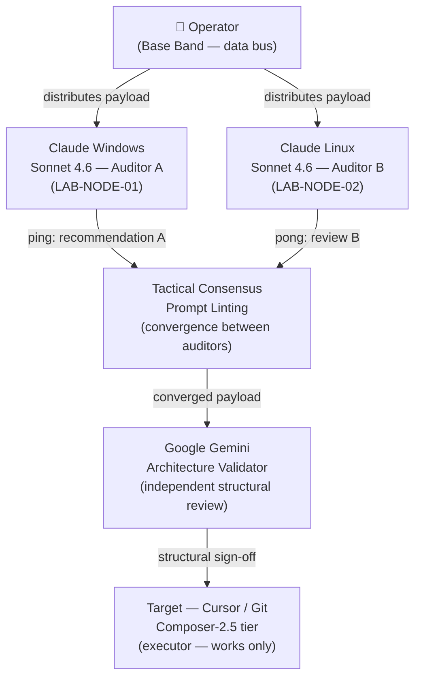

# ADR 0062 — Agent containment: triple-audit offband pattern (A.I.I.D.C.O.B.P.P.)

- **Date (UTC):** 2026-05-22
- **Authors:** Fabio Leitao
- **Deciders:** Fabio Leitao

## Status

Accepted

### Status history

- 2026-05-22 — Accepted
- 2026-05-23 — Amended: quad-audit (4-auditor) variant validated empirically
- 2026-06-11 — Amended: retrofit to ADR-0045 UMADR format (metadata list, EN sections, Status history, Rationale, Alternatives Considered, Related Decisions, Extensibility) — GitHub #674
- 2026-06-21 — Amended: cross-vendor/cross-harness mandate (GitHub #991)

## Context

During the execution of wave-656-u0-u1 (PR #658), the Cursor agent (Composer-2.5) exhibited rule-sequencing drift (`.mdc` rules), ignoring imperative scope boundaries and generating latent regression risk and off-band Anthropic token consumption. Because the IDE's native barriers are chronically non-deterministic, an external state-control mechanism became necessary.

This pattern emerged empirically during the night of 2026-05-21/22 and was validated by three independent auditors: Anthropic Claude Sonnet 4.6 (Windows / LAB-NODE-01), Anthropic Claude Sonnet 4.6 (Linux / LAB-NODE-02), and Google Gemini Pro (structural validation).

**Post-amendment gap (2026-06-21, #991):** Auditors A and B share the **same vendor** (Anthropic). That yields **harness/OS diversity** but **vendor-correlated** failure modes — both models may agree on the same wrong answer for the same structural blind spot. True containment for high-stakes gates requires **cross-vendor** auditors, not only cross-instance or cross-OS clones of one family. The operator's cross-vendor catch on the #406 close guard (protocol doc cite vs deliberate close comment) is an example of **harness-divergent, vendor-correlated** review surfacing a design flaw the executor missed.

## Topology (A.I.I.D.C.O.B.P.P.)

> **Critical topology note:** The two Claude instances do not communicate directly. The Operator is the physical data bus routing payloads between auditors. A direct arrow between them would be an infrastructure hallucination.
>
> **Vendor note (amended 2026-06-21):** A + B in this diagram are **not** sufficient cross-vendor diversity on their own — both are Anthropic. Treat G (Google) as the first **vendor break**; add an OpenAI-family auditor for full triangulation on gate/security work (see Cross-vendor containment below).

## Decision

Implement the Three Independent Pillars Triangulation pattern outside the controlled agent's bus:

1. **State Isolation (Tactical Layer):** Two independent models (Claude Sonnet 4.6) operating on distinct OSes. The operator acts as the physical data bus, routing prompts in a ping-pong until convergence and elimination of typos/gaps.
2. **Boundary Validation (Strategic Layer):** Submit the converged payload to a third independent auditor (Google Gemini) for structural validation.
3. **Idempotent Execution:** Inject the final prompt with synchronous interrupt triggers (`git log`, `gh issue list`) before any push.

### Cross-vendor containment (amended 2026-06-21, #991)

A.I.I.D.C.O.B.P.P. contains real risk only when auditors have **non-correlated failure modes**. The following are **normative** for gate, security, and release-gate work:

1. **Cross-vendor is mandatory for real containment:** Auditors must span **different vendors** (e.g. Anthropic + Google + OpenAI), not only different instances, seats, or OSes of the **same** vendor. Same-vendor triangulation can still echo — that is correlation, not verification.
2. **Cross-harness weighs as much as cross-model:** The same base model in a **different harness** (NotebookLM vs Cursor vs Claude Code) behaves differently. Two models in the **same** harness (e.g. Gemini-in-Cursor + GPT-in-Cursor) re-correlate through shared IDE context, tools, and rules. **Ideal:** different model **and** different harness.
3. **Pin the model — never “Auto”:** Opaque Auto/Premium routing can pull a same-vendor model without the operator knowing, collapsing cross-vendor intent. For gate and security slices, the model ID must be **fixed and recorded** in the session or issue.
4. **Contract separation = budget separation:** The read-only auditor (e.g. Claude Code on its own subscription) must not drain the executor pool (Cursor). Security, cost control, and vendor diversity share one structure: **separate contracts, separate budgets.**
5. **Repository and tests remain sovereign:** Cross-vendor review **reduces** correlation; it does **not** replace git history, CI, pre-commit, or deterministic guards. **LLM consensus ≠ source of truth** (see Documented case below).

**Operator roster (illustrative slots — pin model per session):**

| Slot | Harness / product | Vendor | Role |
|------|-------------------|--------|------|
| **Executor** | Cursor | (pinned model) | Sole write path |
| **C** | Claude Code | Anthropic | Read-only auditor |
| **A** | claude.ai web | Anthropic | Tactical auditor (operator bus) |
| **B** | Claude Sonnet (Windows lab node) | Anthropic | Tactical auditor (distinct OS) |
| **G** | Gemini / NotebookLM | Google | Structural validator |
| **O** *(gap)* | OpenAI product TBD | OpenAI | **Required** for full cross-vendor triangulation on gates |

Until slot **O** is staffed, treat A+B+C as **vendor-correlated** — valuable for typo/scope ping-pong, **insufficient alone** for security-gate sign-off.

### Documented case — negative example

During the drafting of this ADR, three independent AI models (Anthropic ×2, Google) converged on an incorrect filename convention without consulting the repository. The human operator forced verification of the 59 existing ADRs. The repository corrected the consensus of all three algorithms.

> **LLM consensus ≠ source of truth. The source of truth is the repository.**

## Rationale

Agent containment via external multi-auditor triangulation addresses two distinct failure modes:

1. **Scope drift:** A single model operating in isolation accumulates context decay and "creative" interpretation of constraints. Two independent instances with the operator as bus create a natural diff-check.
2. **Hallucination convergence:** Multiple LLMs can independently converge on the same incorrect answer. The repository (git log, file listing) serves as the ground-truth arbiter, not model consensus.

The pattern is intentionally asymmetric: auditors review and converge; only the final, operator-validated payload reaches the executor. This preserves the executor's autonomy for in-scope work while bounding blast radius.

## Alternatives Considered

| Alternative | Why not |
|-------------|---------|
| Single-model review loop | Does not catch scope drift; same model re-validates its own errors |
| Automated CI only | CI runs after execution; does not prevent mid-session drift |
| Operator manual review of every step | Excessive toil; defeats the efficiency rationale for agent assistance |
| GPT-4 as third auditor | Valid alternative; Google Gemini chosen for provider diversity |

## Extensibility

The pattern generalises to N independent auditors (N ≥ 2). A **quad-audit** variant (4 auditors) was validated empirically on 2026-05-23, extending the triple pattern with a fourth model instance for high-stakes decisions. Scaling guidance:

| N | Use when |
|---|----------|
| 2 (dual) | Low-blast-radius chore/docs PRs; **must** include ≥2 vendors for gate/security work |
| 3 (triple) | Standard: **cross-vendor** structural validation (original pattern) |
| 4 (quad) | High-stakes architectural decisions; **cross-vendor + cross-harness** |
| 5+ | Reserved for security-critical decisions with mandatory human sign-off |

**Cross-vendor floor (amended 2026-06-21):** For P0/U0 gates, release gates, and PII/supply-chain slices, N≥2 is **not** sufficient unless at least **two distinct vendors** participate. Same-vendor dual-audit is **harness diversity only**.

The operator (human-in-the-loop) remains the physical data bus in all variants. No direct inter-auditor communication is assumed.

## Consequences

- **Positive:** Regression risk reduced; auditor divergence signals prompt ambiguity; convergence signals green for execution.
- **Negative:** Increased toil on the human operator as synchronisation bus between isolated instances.

## Related Decisions

- [ADR-0045](ADR-0045-adr-metadata-and-format-standardization.md) — UMADR amend-in-place via Status history
- [ADR-0046](ADR-0046-operator-intent-and-blameless-collaboration.md) — non-negotiable guardrails (context)
- [ADR-0071](ADR-0071-self-protecting-pii-gate.md) — self-protecting gates (executor vs auditor finding)
- [ADR-0072](ADR-0072-commit-gate-vs-release-gate-distinct-criteria.md) — release gate FASE 3; #406 close guard (#990)
- [ADR-0061](ADR-0061-u-axis-issue-suborder-and-cross-milestone-gate.md) — U-axis sequencing
- `AGENTS.md` — auditor vs executor policy

## References

- Issue #656 — wave that originated this pattern
- Issue #991 — cross-vendor/cross-harness amendment
- Issue #990 — operator-gated issue close; cross-vendor audit caught executor blind spot
- PR #658 — wave merged with the pattern active
- PR #648 — SoD architecture that motivated external audit
- Issue #659 — origin of this ADR
