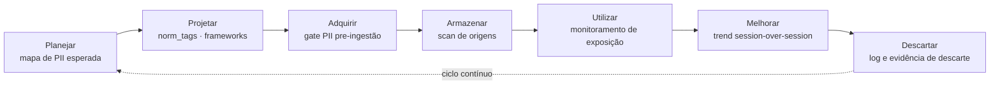
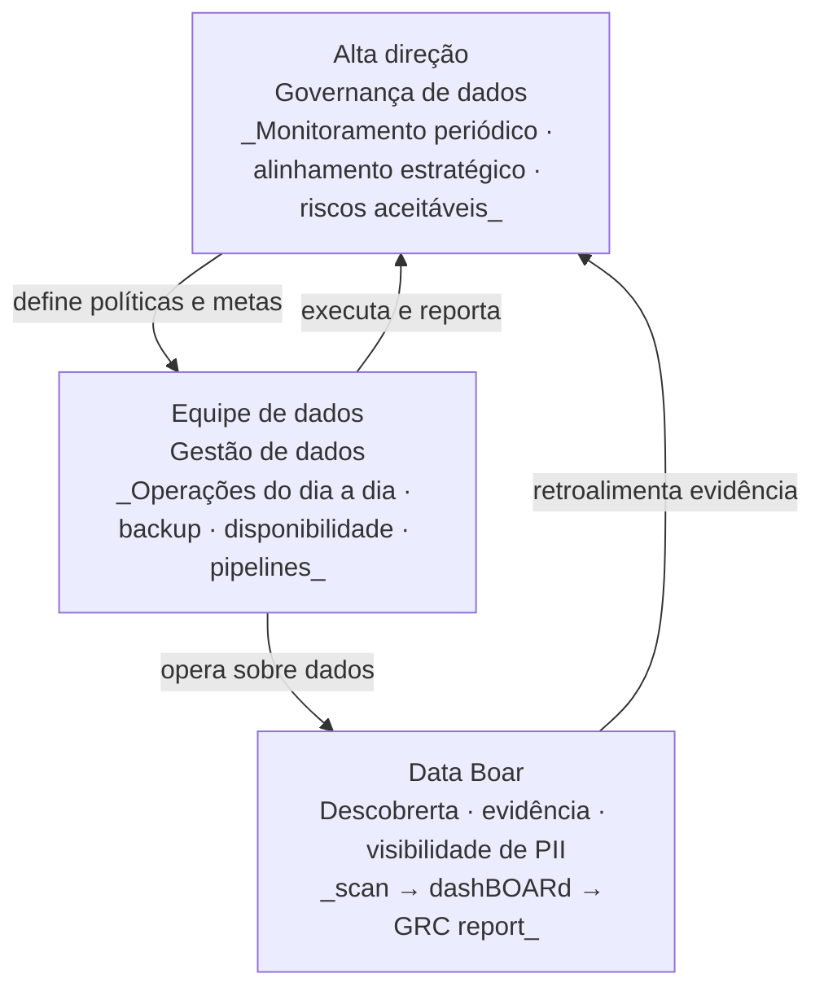
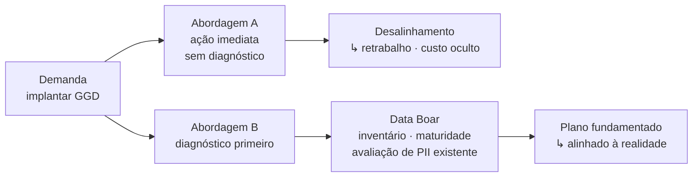

# Data Boar — diagramas DMBOK e ciclo de vida de dados

Diagramas originais. Wording do produto.
Inspiração conceitual: DMBOK (DAMA International, 2017); ISO/IEC 38505; DataOps.

---

## 1. Data Boar nas 11 áreas de conhecimento do DMBOK

| Zona | Área de conhecimento | Papel do Data Boar |
|---|---|---|
| **Núcleo** | Governança de dados | scan manifest · GRC report · evidência auditável |
| **Núcleo** | Segurança de dados | PII discovery · exposição real por fonte e tipo |
| **Núcleo** | Gestão de metadados | norm_tags · plugin_schema · perfil de sensibilidade |
| Contribui | Arquitetura de dados | inventário de origens como entrada para arquitetura |
| Contribui | Armazenamento e operação de dados | scan de bancos, arquivos e streams |
| Contribui | Integração e interoperabilidade | conectores e plugins por fonte |
| Contribui | Qualidade de dados | perfil de sensibilidade como dimensão de qualidade |
| Contexto | Modelagem e projeto de dados | — |
| Contexto | Gestão de documentos e conteúdo | — |
| Contexto | Dados de referência e dados mestre | — |
| Contexto | Data warehouse e business intelligence | — |

> Referência: DAMA International. *Data Management Body of Knowledge (DMBOK)*. 2.ed. 2017.

---

## 2. Ciclo de vida de dados + Data Boar

### Onde o Data Boar opera ativamente

| Etapa | Data Boar | Artefato gerado |
|---|---|---|
| Armazenar | Scan de bancos, arquivos, streams | `scan_manifest` + findings |
| Utilizar | Monitoramento de exposição em produção | dashBOARd · GRC report |
| Melhorar | Comparação histórica entre sessões | trend session-over-session |
| Descartar | Verificação de sanitização | log de descarte auditável |

### DataOps e MLOps — extensões do ciclo

O DataOps aplica práticas de DevOps ao ciclo de dados: automação de fluxos, integração contínua e entrega rápida de dados confiáveis. O MLOps estende isso para modelos de aprendizado de máquina, sincronizando ciclos de modelo com ciclos de dados.

O Data Boar funciona como **gate de qualidade** nesse fluxo: antes de promover dados para produção ou treinar modelos, o scan verifica a presença de PII não classificada.

---

## 3. Gestão × Governança de dados — distinção operacional

| Dimensão | Governança | Gestão |
|---|---|---|
| Nível | Estratégico / periódico | Operacional / contínuo |
| Pergunta central | A área está alinhada à estratégia? | As atividades estão sendo executadas? |
| Frequência | Reuniões periódicas · indicadores-chave | Dia a dia |
| Responsável | Alta direção · board | Gerentes e equipes técnicas |
| Papel do Data Boar | Evidência para o ciclo EDM | Visibilidade operacional de dados |

---

## 4. O argumento de pitch — por que inventariar primeiro

> "Você não pode governar o que não inventariou."
> A Consultoria B faz a avaliação de maturidade *antes* de propor o plano — e o Data Boar é o instrumento dessa avaliação para o domínio de dados sensíveis.

---

## 5. ISO/IEC 38505 — governança de dados especificamente

A ISO/IEC 38505 estende os princípios da ISO/IEC 38500 (governança corporativa de TI)
para o domínio específico de dados. Foco: valor dos dados, riscos a mitigar,
alinhamento da gestão de dados à governança de TI e corporativa.

Esta norma não está ainda em `docs/COMPLIANCE_AND_LEGAL.md` — adicionar na próxima atualização.

- [ISO/IEC 38505](https://www.iso.org/standard/56639.html)
- [ISO/IEC 38500](https://www.iso.org/standard/62816.html)
- [DMBOK (DAMA)](https://www.dama.org/cpages/body-of-knowledge)

---

*Diagramas originais — wording e posicionamento Data Boar.*
*Conceitos de referência: DMBOK (DAMA International, 2017); ISO/IEC 38505; DataOps; MLOps.*
*Não reproduz tabelas ou texto normativo das publicações DAMA, ABNT ou ISO.*

---

## 6. EU Data Governance Act (DGA) — EU Regulation 2022/868

Referência nova identificada em Aula 3 — Segurança e Aspectos Éticos de Dados.

**O que é:**
- Vigente: junho 2022; aplicável a todos os 27 países-membros da UE desde setembro de 2023
- Objetivo: aumentar a confiança no compartilhamento voluntário de dados entre empresas e cidadãos da UE
- Instrumento intersetorial para reutilização de dados públicos e compartilhamento ético de dados privados
- Abrange dados pessoais E não pessoais. Para dados pessoais, aplica-se também o RGPD (GDPR)

**Distinção crítica — GDPR/LGPD vs DGA:**

| Framework | Foco | Tipo de dado | Jurisdição |
|---|---|---|---|
| GDPR / RGPD | Proteção de dados pessoais | Pessoais | União Europeia |
| LGPD | Proteção de dados pessoais | Pessoais | Brasil |
| DGA | Compartilhamento e reutilização | Pessoais + não pessoais | União Europeia |
| ISO 27001/27002 | Controles de segurança da informação | Qualquer | Internacional |
| DMBOK | Boa prática de gestão de dados | Qualquer | Internacional |

**Conexão com Data Boar:**
O DGA exige que dados compartilhados entre organizações sejam identificados, classificados e rastreáveis. O Data Boar é o instrumento que fornece essa visibilidade antes do compartilhamento: descoberta → classificação → evidência auditável.

**Para o repo:** adicionar em `docs/COMPLIANCE_AND_LEGAL.md` junto com ISO/IEC 38505 e DMBOK (issue #638).

- DGA: https://digital-strategy.ec.europa.eu/en/policies/data-governance-act
- EU Regulation 2022/868: https://eur-lex.europa.eu/legal-content/EN/TXT/?uri=CELEX%3A32022R0868

---

*Diagrama adicional desta sessão: `databoar_regulatory_convergence` — GDPR × DGA × LGPD × ISO 27001 convergindo para o Data Boar como camada de descoberta comum.*
