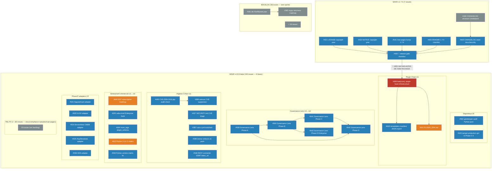

---
# Issue Queue Sequencing Map
<!-- auto-maintained: refresh when new issues are added or NÃO INICIAR chains change -->
**Última atualização:** 2026-06-21
**Total open issues:** 145

## Contagens

| Dimensão | Distribuição |
|---|---|
| P0/P1/P2/P3 | 2/6/99/38 |
| v1.7.4 / v1.8.0-beta / backlog | 7/102/36 |
| U0/U1/U2/U3/sem U | 2/9/18/5/111 |
| G3/G2/G1/sem G | 2/4/1/138 |
---
