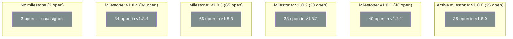

# Issue Queue Sequencing Map
<!-- auto-maintained: run `uv run python scripts/issue_queue_sequencing_map.py --write` -->
**Última atualização:** 2026-08-30
**Total open issues:** 260

Snapshot via `gh issue list --state open` + GraphQL `issueType` (DataBoar/data-boar). **GitHub is the source of truth for milestone assignment** — this file mirrors that distribution; do not move issues in GitHub to match stale `.md`. Contagens ±5% por race com o GitHub.

- Cross-milestone re-alignment protocol (HITL): [#1522](https://github.com/DataBoar/data-boar/issues/1522) · [ADR-0061](../adr/ADR-0061-u-axis-issue-suborder-and-cross-milestone-gate.md)
- Hard-blocker helper (follow-up): [#1523](https://github.com/DataBoar/data-boar/issues/1523)

```mermaid
flowchart TD

subgraph ms_1["Active milestone: v1.8.0 (35 open)"]
  n1["35 open in v1.8.0"]:::p3
end

subgraph ms_2["Milestone: v1.8.1 (40 open)"]
  n2["40 open in v1.8.1"]:::p3
end

subgraph ms_3["Milestone: v1.8.2 (33 open)"]
  n3["33 open in v1.8.2"]:::p3
end

subgraph ms_4["Milestone: v1.8.3 (65 open)"]
  n4["65 open in v1.8.3"]:::p3
end

subgraph ms_5["Milestone: v1.8.4 (84 open)"]
  n5["84 open in v1.8.4"]:::p3
end

subgraph unassigned["No milestone (3 open)"]
  n6["3 open — unassigned"]:::p3
end

classDef p0 fill:#c0392b,color:#fff
classDef p1 fill:#e67e22,color:#fff
classDef p2 fill:#2980b9,color:#fff
classDef p3 fill:#7f8c8d,color:#fff
```

Governance Lens Phases A–E ([#539](https://github.com/DataBoar/data-boar/issues/539)–[#543](https://github.com/DataBoar/data-boar/issues/543)) are **closed** — the previous `NÃO INICIAR ANTES DE #539` edges are **not** live.

**v1.8.1** (GitHub, 40 open — do **not** treat as v1.8.0 work in `PLANS_TODO.md`): `#531`, `#533`, `#534`, `#535`, `#536`, `#558`, `#677`, `#742`, `#743`, `#745`, `#747`, `#748`, `#749`, `#750`, `#752`, `#755`, `#756`, `#759`, `#762`, `#765`, `#768`, `#784`, `#873`, `#1322`, `#1332`, `#1578`, `#1718`, `#1730`, `#1731`, `#1732`, `#1733`, `#1734`, `#1739`, `#1756`, `#1760`, `#1761`, `#1762`, `#1763`, `#1820`, `#1839`.

**No milestone** (3 open): `#696`, `#697`, `#1538` — assign or defer via [#1522](https://github.com/DataBoar/data-boar/issues/1522) hygiene.

## Hard-blockers (active)

Open issues whose bodies still contain `**NÃO INICIAR ANTES DE #N**` (or equivalent) **and** whose blocker `#N` is still open:

| Blocker | Blocks (open) |
| --- | --- |
| — | **None** (scan of open issue bodies on 2026-08-30) |

### Stale `NÃO INICIAR` text (blocker already closed)

Not drawn as live edges — body cleanup is out of scope for this refresh:

| Open issue | Still cites | Blocker state |
| --- | --- | --- |
| — | — | — |

Removed from the previous map: `#539 → #540–#543` (all five closed); `#668` citing `#406` (`#668` now closed); `#406 → #606` (both closed); `#382` citing `#381` (both closed as of 2026-08-30).

## Contagens

| Dimensão | Distribuição |
| --- | --- |
| Total open | 260 |
| Issue Type Bug / Feature / Task / (none) | 31 / 80 / 149 |
| P0 / P1 / P2 / P3 / sem P (`[Pn]` in title, body, or labels) | 0 / 11 / 76 / 47 / 126 |
| Milestone v1.8.0 / v1.8.1 / v1.8.2 / v1.8.3 / v1.8.4 / backlog / (none) | 35 / 40 / 33 / 65 / 84 / 0 / 3 |
| U0 / U1 / U2 / U3 / sem U (`[Un]` in title or body) | 0 / 0 / 1 / 0 / 259 |
| Active hard-blocker edges | 0 |
