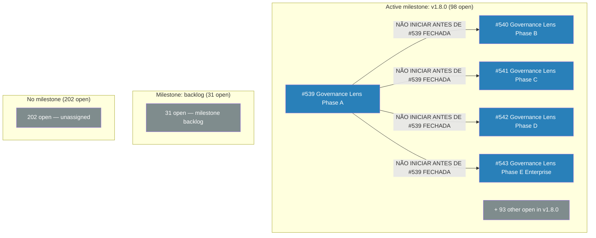

---
# Issue Queue Sequencing Map
<!-- auto-maintained: refresh when new issues are added or NÃO INICIAR chains change -->
**Última atualização:** 2026-08-10
**Total open issues:** 331

Snapshot via `gh issue list --state open` (DataBoar/data-boar). Contagens ±5% por race com o GitHub.

- Cross-milestone re-alignment protocol (HITL): [#1522](https://github.com/DataBoar/data-boar/issues/1522) · [ADR-0061](../adr/ADR-0061-u-axis-issue-suborder-and-cross-milestone-gate.md)
- Hard-blocker helper (follow-up): [#1523](https://github.com/DataBoar/data-boar/issues/1523)

```mermaid
flowchart TD

subgraph ACTIVE_MS["Active milestone: v1.8.0 (98 open)"]
  i539["#539 Governance Lens Phase A"]:::p2
  i540["#540 Governance Lens Phase B"]:::p2
  i541["#541 Governance Lens Phase C"]:::p2
  i542["#542 Governance Lens Phase D"]:::p2
  i543["#543 Governance Lens Phase E Enterprise"]:::p2
  v180_tail["+ 93 other open in v1.8.0"]:::p3
  i539 -->|"NÃO INICIAR ANTES DE #539 FECHADA"| i540
  i539 -->|"NÃO INICIAR ANTES DE #539 FECHADA"| i541
  i539 -->|"NÃO INICIAR ANTES DE #539 FECHADA"| i542
  i539 -->|"NÃO INICIAR ANTES DE #539 FECHADA"| i543
end

subgraph BACKLOG_MS["Milestone: backlog (31 open)"]
  backlog_node["31 open — milestone backlog"]:::p3
end

subgraph UNASSIGNED["No milestone (202 open)"]
  unassigned_node["202 open — unassigned"]:::p3
end

classDef p0 fill:#c0392b,color:#fff
classDef p1 fill:#e67e22,color:#fff
classDef p2 fill:#2980b9,color:#fff
classDef p3 fill:#7f8c8d,color:#fff
```

## Hard-blockers (active)

Open issues whose bodies still contain `**NÃO INICIAR ANTES DE #N**` (or equivalent) **and** whose blocker `#N` is still open:

| Blocker | Blocks (open) |
| --- | --- |
| [#539](https://github.com/DataBoar/data-boar/issues/539) | [#540](https://github.com/DataBoar/data-boar/issues/540), [#541](https://github.com/DataBoar/data-boar/issues/541), [#542](https://github.com/DataBoar/data-boar/issues/542), [#543](https://github.com/DataBoar/data-boar/issues/543) |

### Stale `NÃO INICIAR` text (blocker already closed)

Not drawn as live edges — body cleanup is out of scope for this refresh:

| Open issue | Still cites | Blocker state |
| --- | --- | --- |
| [#668](https://github.com/DataBoar/data-boar/issues/668) | `#406` | closed |
| [#382](https://github.com/DataBoar/data-boar/issues/382) | `#381` | closed |

Removed from the previous map: `#406 → #606` (both closed; classic release-gate → plugin-hook edge).

## Contagens

| Dimensão | Distribuição |
| --- | --- |
| Total open | 331 |
| P0 / P1 / P2 / P3 / sem P | 1 / 4 / 106 / 55 / 165 |
| Milestone v1.8.0 / backlog / (none) | 98 / 31 / 202 |
| U0 / U1 / U2 / U3 / sem U (body marker) | 1 / 2 / 14 / 11 / 303 |
| Active hard-blocker edges | 4 (all `#539 →` Phase B–E) |

---
