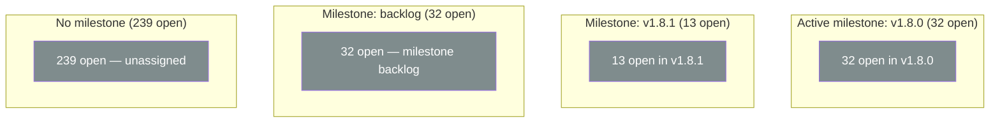

# Issue Queue Sequencing Map
<!-- auto-maintained: refresh when new issues are added or NÃO INICIAR chains change -->
**Última atualização:** 2026-08-26
**Total open issues:** 316

Snapshot via `gh issue list --state open` (DataBoar/data-boar). **GitHub is the source of truth for milestone assignment** — this file mirrors that distribution; do not move issues in GitHub to match stale `.md`. Contagens ±5% por race com o GitHub.

- Cross-milestone re-alignment protocol (HITL): [#1522](https://github.com/DataBoar/data-boar/issues/1522) · [ADR-0061](../adr/ADR-0061-u-axis-issue-suborder-and-cross-milestone-gate.md)
- Hard-blocker helper (follow-up): [#1523](https://github.com/DataBoar/data-boar/issues/1523)

```mermaid
flowchart TD

subgraph ACTIVE_MS["Active milestone: v1.8.0 (32 open)"]
  v180_all["32 open in v1.8.0"]:::p3
end

subgraph NEXT_MS["Milestone: v1.8.1 (13 open)"]
  v181_all["13 open in v1.8.1"]:::p3
end

subgraph BACKLOG_MS["Milestone: backlog (32 open)"]
  backlog_node["32 open — milestone backlog"]:::p3
end

subgraph UNASSIGNED["No milestone (239 open)"]
  unassigned_node["239 open — unassigned"]:::p3
end

classDef p0 fill:#c0392b,color:#fff
classDef p1 fill:#e67e22,color:#fff
classDef p2 fill:#2980b9,color:#fff
classDef p3 fill:#7f8c8d,color:#fff
```

Governance Lens Phases A–E ([#539](https://github.com/DataBoar/data-boar/issues/539)–[#543](https://github.com/DataBoar/data-boar/issues/543)) are **closed** — the previous `NÃO INICIAR ANTES DE #539` edges are **not** live.

**v1.8.1** (GitHub, 13 open — do **not** treat as v1.8.0 work in `PLANS_TODO.md`): `#531`, `#533`, `#534`, `#535`, `#536`, `#558`, `#1322`, `#1578`, `#1718`, `#1756`, `#1760`, `#1761`, `#1762`.

## Hard-blockers (active)

Open issues whose bodies still contain `**NÃO INICIAR ANTES DE #N**` (or equivalent) **and** whose blocker `#N` is still open:

| Blocker | Blocks (open) |
| --- | --- |
| — | **None** (scan of open issue bodies on 2026-08-26) |

### Stale `NÃO INICIAR` text (blocker already closed)

Not drawn as live edges — body cleanup is out of scope for this refresh:

| Open issue | Still cites | Blocker state |
| --- | --- | --- |
| [#382](https://github.com/DataBoar/data-boar/issues/382) | `#381` | closed |

Removed from the previous map: `#539 → #540–#543` (all five closed); `#668` citing `#406` (`#668` now closed); `#406 → #606` (both closed).

## Contagens

| Dimensão | Distribuição |
| --- | --- |
| Total open | 316 |
| P0 / P1 / P2 / P3 / sem P (`[Pn]` in title, body, or labels) | 3 / 16 / 103 / 62 / 132 |
| Milestone v1.8.0 / v1.8.1 / backlog / (none) | 32 / 13 / 32 / 239 |
| U0 / U1 / U2 / U3 / sem U (`[Un]` in title or body) | 0 / 0 / 1 / 0 / 315 |
| Active hard-blocker edges | 0 |
