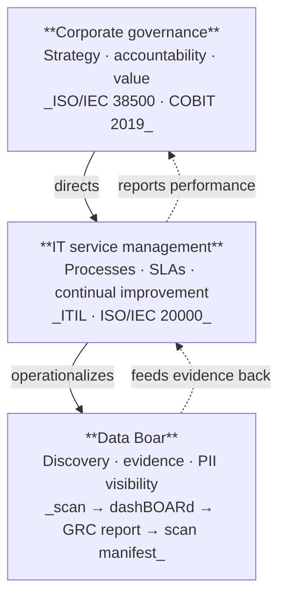
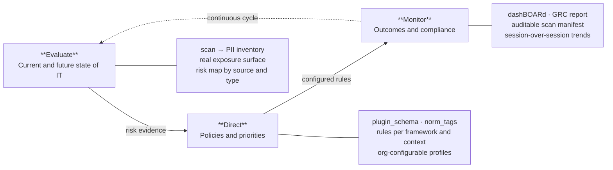

# Data Boar — governance positioning diagrams

**Português (Brasil):** [DATABOAR_GOVERNANCE_DIAGRAMS.pt_BR.md](DATABOAR_GOVERNANCE_DIAGRAMS.pt_BR.md)

Original diagrams for primers and stakeholder pitches. Product-specific wording. Conceptual inspiration: ISO/IEC 38500, COBIT 2019, ITIL 4, ISO/IEC 20000.

---

## 1. Governance stack — where Data Boar operates

> Data Boar is not a GRC platform or a governance framework.
> It is the discovery layer that makes governance verifiable.

---

## 2. EDM cycle — Data Boar at each stage

The ISO/IEC 38500 Evaluate → Direct → Monitor (EDM) model describes how leadership steers responsible technology use. Data Boar operates as the operational evidence layer at each stage.

---

## 3. Five ITIL practices — Data Boar mapping

| ITIL practice | What it does | How Data Boar contributes |
| --- | --- | --- |
| **Incident management** | Restore interrupted services with minimal impact | PII exposure in production is a data incident. Scanning locates sensitive data *before* breach, shrinking impact surface when an incident occurs. |
| **Problem management** | Identify and eliminate root causes of recurring incidents | Recurring PII in logs or staging DBs is a systemic problem. Session-over-session scan history reveals which pipeline keeps generating exposure after remediation. |
| **Change control** | Implement changes with controlled risk | Pre/post-deploy scans detect whether a change introduced new PII exposure. Potential quality gate in CI/CD before production promotion. |
| **Capacity and performance** | Ensure resources meet current and future demand | Configurable sampling, per-target timeouts, character budgets per scan. `scan_manifest` documents coverage depth — operational transparency on limits. |
| **Service continuity** | Recover within agreed time after disaster | `scan_manifest` + auditable evidence supports post-incident diligence: *what existed, where, when verified*. Documentary base for regulator response after a breach. |

---

## 4. Corporate governance × IT governance × ITSM

| Dimension | Corporate governance | IT governance | IT service management (ITSM) |
| --- | --- | --- | --- |
| **Level** | Strategic | Strategic / Tactical | Tactical / Operational |
| **Focus** | Organizational direction | Responsible use of IT | Service delivery and operations |
| **Central question** | Where are we going? | How does IT serve that? | How do we deliver with quality? |
| **Owner** | Board / C-suite | Executive leadership + IT management | IT teams + partners |
| **Reference models** | IBGC, corporate governance codes | ISO/IEC 38500, COBIT | ITIL, ISO/IEC 20000 |
| **Data Boar role** | Evidence for reporting | Inventory for EDM | Data visibility for five practices |

---

*Original diagrams — Data Boar wording and positioning.*
*Reference concepts: ISO/IEC 38500, COBIT 2019, ITIL 4, ISO/IEC 20000.*
*Does not reproduce normative text or tables from ABNT/ISACA publications.*

Recovered from primary Windows dev workstation backup (2026-06); tracks GitHub **#992**.
