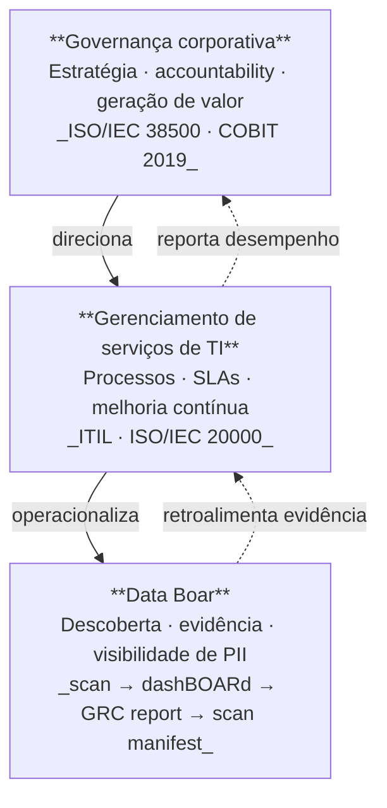
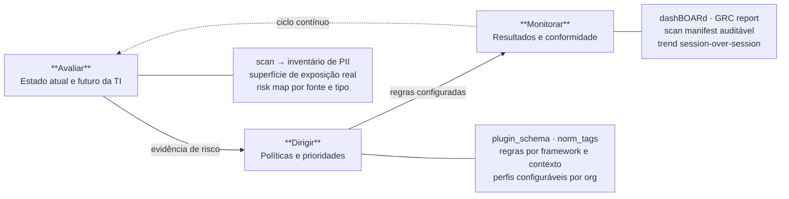

# Data Boar — diagramas de posicionamento em governança de TI

**English:** [DATABOAR_GOVERNANCE_DIAGRAMS.md](DATABOAR_GOVERNANCE_DIAGRAMS.md)

Diagramas originais para primers e pitches do repo. Wording próprio do produto. Inspiração conceitual: ISO/IEC 38500, COBIT 2019, ITIL 4, ISO/IEC 20000.

---

## 1. A pilha de governança — onde o Data Boar opera

> O Data Boar não é uma plataforma GRC nem um framework de governança.
> É a camada de descoberta que torna a governança verificável.

---

## 2. Ciclo EDM — o Data Boar em cada etapa

O modelo Avaliar → Dirigir → Monitorar (EDM) da ISO/IEC 38500 descreve como a alta direção conduz o uso responsável da tecnologia. O Data Boar opera como camada operacional de evidência em cada etapa.

---

## 3. As 5 práticas ITIL — mapeamento ao Data Boar

| Prática ITIL | O que a prática faz | Como o Data Boar contribui |
| --- | --- | --- |
| **Gestão de incidentes** | Restaurar serviços interrompidos com mínimo de impacto | Exposição de PII em produção é um incidente de dados. O scan identifica onde dados sensíveis residem *antes* da quebra, reduzindo superfície de impacto quando o incidente ocorre. |
| **Gestão de problemas** | Identificar e eliminar causas-raiz de incidentes recorrentes | PII recorrente em logs ou bancos de homologação = problema sistêmico. O histórico de scans session-over-session revela qual pipeline continua gerando exposição mesmo após remediação. |
| **Controle de mudanças** | Garantir que mudanças sejam implementadas com risco controlado | Scan pré/pós-deploy detecta se uma mudança introduziu nova exposição de PII. Potencial gate de qualidade em CI/CD antes de promoção para produção. |
| **Gestão de capacidade e desempenho** | Assegurar que recursos atendam demanda atual e futura | Sampling configurável, timeouts por alvo, orçamento de caracteres por scan. O `scan_manifest` documenta o que foi coberto e com qual profundidade — transparência operacional sobre limites. |
| **Gestão da continuidade de serviços** | Garantir recuperação dentro de prazos acordados após desastre | O `scan_manifest` + evidência auditável integra o pacote de diligência pós-incidente: *o que existia, onde estava, quando foi verificado*. Base documental para resposta a reguladores após uma quebra. |

---

## 4. Comparativo: governança corporativa × governança de TI × ITSM

| Dimensão | Governança corporativa | Governança de TI | Gerenciamento de serviços (ITSM) |
| --- | --- | --- | --- |
| **Nível** | Estratégico | Estratégico / Tático | Tático / Operacional |
| **Foco** | Direção da organização | Uso responsável da TI | Entrega e operação de serviços |
| **Pergunta central** | Para onde vamos? | Como a TI serve isso? | Como entregamos com qualidade? |
| **Responsável** | Conselho / C-suite | Alta direção + gestão de TI | Times de TI + parceiros |
| **Modelos de referência** | IBGC, governança corporativa | ISO/IEC 38500, COBIT | ITIL, ISO/IEC 20000 |
| **Papel do Data Boar** | Evidência para reporting | Inventário para EDM | Visibilidade de dados para 5 práticas |

---

*Diagramas originais — wording e posicionamento Data Boar.*
*Conceitos de referência: ISO/IEC 38500, COBIT 2019, ITIL 4, ISO/IEC 20000.*
*Não reproduz texto normativo ou tabelas das publicações ABNT/ISACA.*

Recuperado do backup da estação Windows primária (2026-06); rastreia GitHub **#992**.
