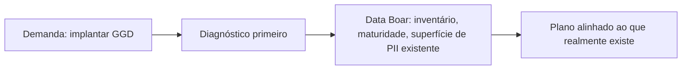

# Pitch para Data Officer — CDO, stewards e engenheiros de dados sênior

**English:** [PITCH_DATA_OFFICER.md](PITCH_DATA_OFFICER.md) · **Índice:** [INDEX.pt_BR.md](INDEX.pt_BR.md)

**Público:** Chief Data Officers (CDO), Data Stewards e engenheiros de dados sênior que falam DAMA-DMBOK (ciclo de vida, qualidade, stewardship)—não o jurídico nem o conselho de compras.

---

## O problema que essa audiência já reconhece

Não dá para governar dado que não foi inventariado. Um programa de gestão e governança de dados (GGD / DAMA-DMBOK) que começa em política e modelo **sem** um mapa atual de **onde os dados pessoais e sensíveis realmente estão** gera planos que auditor e engenheiro não conseguem executar.

A pergunta não é “temos política?”. É “onde está o dado sensível, e conseguimos mostrar a um auditor o que encontramos?”

Vocabulário: [GLOSSARY.pt_BR.md](../GLOSSARY.pt_BR.md) §12 (DMBOK, Data Steward, qualidade de dados).

## O que o Data Boar é nesse programa

Um **instrumento de avaliação de maturidade para dados sensíveis já existentes no patrimônio**—passo 0 antes de um plano de GGD fundamentado. Localiza e classifica **possível** exposição pessoal e sensível (arquivos, bancos, compartilhamentos, exportações de aplicação) e emite **evidência por sessão** (achados, heatmap, Audit Trail).

- **É:** descoberta técnica, apoio a inventário, evidência repetível para stewards e engenheiros.
- **Não é:** substituto de catálogo de dados, “mangueira” de qualidade, assessoria jurídica nem decisão de Data Owner.

Brief de liderança (se precisar do slide de conselho): [DECISION_MAKER_VALUE_BRIEF.pt_BR.md](../DECISION_MAKER_VALUE_BRIEF.pt_BR.md).

## Ciclo de vida em que a descoberta é crítica

O DAMA-DMBOK organiza várias funções. Duas etapas são onde **dado sensível desconhecido** mais quebra o programa:

| Etapa | Por que a descoberta importa |
| ----- | ---------------------------- |
| **Armazenar** | O dado fica em arquivos, RDBMS, NoSQL, object stores e backups—muitas vezes fora do catálogo que o steward mantém. |
| **Utilizar** | Exportações, relatórios, notebooks e dumps de SaaS copiam dados para lugares que a política nunca nomeou. |

O Data Boar amostra **alvos configurados** e relata **locais e classes de padrão**. Não reescreve grafos de linhagem nem certifica pontuações ISO/IEC 25012.

## Responsabilidade compartilhada (um slide)

| Parte | Responsabilidade |
| ----- | ---------------- |
| **Sua organização** | Escopo lícito, RACI de Data Owner / Steward, credenciais, retenção, o que remediar |
| **Data Boar** | Varreduras configuradas, achados técnicos, artefatos repetíveis de sessão |

## Resultados realistas em 30 / 60 / 90 dias

> **Implantar em horas. Primeira varredura em dias.** Os horizontes abaixo são maturidade operacional, não tempo de ativação.

| Horizonte | Marco realista |
| --------- | -------------- |
| **30 dias** | Varredura com escopo em stores/exportações combinados; heatmap de classes de padrão de alto risco; donos steward vs engenheiro nomeados |
| **60 dias** | Cadência repetível; tendência entre sessões; glossário alinhado com DPO/segurança (as mesmas palavras, não dois inventários) |
| **90 dias** | Pacote de evidência que **informa** um roadmap de GGD e a **preparação** de auditoria—não prova de que a governança está completa |

## Próximos passos

- **Profundidade segurança / GRC:** [PITCH_CISO.pt_BR.md](PITCH_CISO.pt_BR.md)
- **Profundidade privacidade / base legal:** [PITCH_DPO.pt_BR.md](PITCH_DPO.pt_BR.md)
- **Ciclo Avaliar–Dirigir–Monitorar de TI:** [PITCH_IT_GOVERNANCE.pt_BR.md](PITCH_IT_GOVERNANCE.pt_BR.md)
- **Detecção vs hype generativo:** [COMPLIANCE_FRAMEWORKS.pt_BR.md](../COMPLIANCE_FRAMEWORKS.pt_BR.md)
