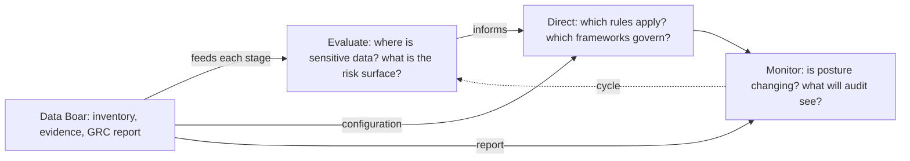

# IT Governance pitch — CIO and IT governance leads

**Português (Brasil):** [PITCH_IT_GOVERNANCE.pt_BR.md](PITCH_IT_GOVERNANCE.pt_BR.md) · **Index:** [INDEX.md](INDEX.md)

**Audience:** CIOs, IT managers, and people accountable for **IT governance**—alignment of IT with the business, process maturity, and operational accountability. Distinct from the CISO (control and cyber risk) and from the board (business outcome).

---

## The problem this audience already has

The **Evaluate–Direct–Monitor (EDM)** cycle (ISO/IEC 38500 language: evaluate current use of IT, direct policy and investment, monitor performance and conformance) stays **incomplete** when nobody can answer, with evidence: *where is the sensitive data, and what will an auditor actually find?*

Without that visibility, “direct” is policy on paper and “monitor” is a dashboard of systems that never included shadow copies and exports.

## What Data Boar is in that cycle

A **discovery layer** that makes EDM **more verifiable**: inventory and session evidence for Evaluate, configurable scope and framework **profiles** for Direct, and structured reports (including GRC-oriented JSON) for Monitor. It does **not** replace COBIT processes, an ISMS, or your service-management tool.

- **It is:** technical discovery, mapping, trend between sessions, workshop-ready evidence.
- **It is not:** legal advice, ISO certification, or a substitute for your DPO, CISO programme, or external auditor.

Positioning: [DECISION_MAKER_VALUE_BRIEF.md](../DECISION_MAKER_VALUE_BRIEF.md). Framework samples: [COMPLIANCE_FRAMEWORKS.md](../COMPLIANCE_FRAMEWORKS.md).

## Shared responsibility (one slide)

| Party | Owns |
| ----- | ---- |
| **Your organization** | Lawful scope, IT/business RACI, credentials, retention, interpretation, tickets |
| **Data Boar** | Configured scans, technical findings, repeatable session artifacts |

## Outcomes you can expect in 30 / 60 / 90 days

> **Deploy in hours. First scan in days.** Horizons below are operational maturity, not activation time.

| Horizon | Realistic milestone |
| ------- | ------------------- |
| **30 days** | First scoped scan; shared picture of high-risk locations for IT and business owners |
| **60 days** | Repeatable cadence; Direct decisions (scope, profiles) reflected in config, not only slides |
| **90 days** | Monitor pack suitable for audit **preparation** and governance committees—not proof of conformance by itself |

## Next step

- **Security / control depth:** [PITCH_CISO.md](PITCH_CISO.md)
- **Privacy / DPO depth:** [PITCH_DPO.md](PITCH_DPO.md)
- **Board / procurement narrative:** [PITCH_STAKEHOLDER.md](PITCH_STAKEHOLDER.md)
- **One-page value brief:** [DECISION_MAKER_VALUE_BRIEF.md](../DECISION_MAKER_VALUE_BRIEF.md)
- **GRC JSON contract:** [GRC_EXECUTIVE_REPORT_SCHEMA.md](../GRC_EXECUTIVE_REPORT_SCHEMA.md)
