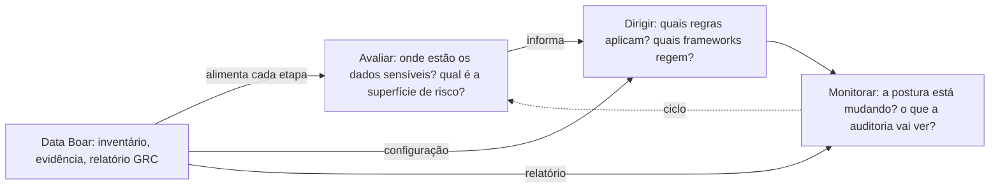

# Pitch de governança de TI — CIO e responsáveis por Governança de TI

**English:** [PITCH_IT_GOVERNANCE.md](PITCH_IT_GOVERNANCE.md) · **Índice:** [INDEX.pt_BR.md](INDEX.pt_BR.md)

**Público:** CIOs, gerentes de TI e pessoas responsáveis por **governança de TI**—alinhamento TI–negócio, maturidade de processos e accountability operacional. Distinto do CISO (controle e risco cibernético) e do conselho (resultado de negócio).

---

## O problema que essa audiência já reconhece

O ciclo **Avaliar–Dirigir–Monitorar (EDM)** (vocabulário ISO/IEC 38500: avaliar o uso atual de TI, dirigir política e investimento, monitorar desempenho e conformidade) fica **incompleto** quando ninguém responde, com evidência: *onde estão os dados sensíveis, e o que a auditoria vai encontrar de fato?*

Sem essa visibilidade, “dirigir” vira política no papel e “monitorar” vira dashboard de sistemas que nunca incluíram cópias sombra e exportações.

## O que o Data Boar é nesse ciclo

Uma **camada de descoberta** que torna o EDM **mais verificável**: inventário e evidência de sessão para Avaliar, escopo e **perfis** de framework configuráveis para Dirigir, e relatórios estruturados (incluindo JSON orientado a GRC) para Monitorar. **Não** substitui processos COBIT, um SGSI nem a ferramenta de gestão de serviços.

- **É:** descoberta técnica, mapeamento, tendência entre sessões, evidência para oficina.
- **Não é:** assessoria jurídica, certificação ISO nem substituto do DPO, do programa do CISO ou do auditor externo.

Posicionamento: [DECISION_MAKER_VALUE_BRIEF.pt_BR.md](../DECISION_MAKER_VALUE_BRIEF.pt_BR.md). Amostras de framework: [COMPLIANCE_FRAMEWORKS.pt_BR.md](../COMPLIANCE_FRAMEWORKS.pt_BR.md).

## Responsabilidade compartilhada (um slide)

| Parte | Responsabilidade |
| ----- | ---------------- |
| **Sua organização** | Escopo lícito, RACI TI/negócio, credenciais, retenção, interpretação, tickets |
| **Data Boar** | Varreduras configuradas, achados técnicos, artefatos repetíveis de sessão |

## Resultados realistas em 30 / 60 / 90 dias

> **Implantar em horas. Primeira varredura em dias.** Os horizontes abaixo são maturidade operacional, não tempo de ativação.

| Horizonte | Marco realista |
| --------- | -------------- |
| **30 dias** | Primeira varredura com escopo; visão compartilhada de locais de alto risco para TI e donos de negócio |
| **60 dias** | Cadência repetível; decisões de Dirigir (escopo, perfis) refletidas na configuração, não só em slides |
| **90 dias** | Pacote de Monitorar adequado à **preparação** de auditoria e comitês de governança—não prova de conformidade por si só |

## Próximos passos

- **Profundidade segurança / controle:** [PITCH_CISO.pt_BR.md](PITCH_CISO.pt_BR.md)
- **Profundidade privacidade / DPO:** [PITCH_DPO.pt_BR.md](PITCH_DPO.pt_BR.md)
- **Narrativa de conselho / compras:** [PITCH_STAKEHOLDER.pt_BR.md](PITCH_STAKEHOLDER.pt_BR.md)
- **Brief de valor (uma página):** [DECISION_MAKER_VALUE_BRIEF.pt_BR.md](../DECISION_MAKER_VALUE_BRIEF.pt_BR.md)
- **Contrato JSON GRC:** [GRC_EXECUTIVE_REPORT_SCHEMA.pt_BR.md](../GRC_EXECUTIVE_REPORT_SCHEMA.pt_BR.md)
