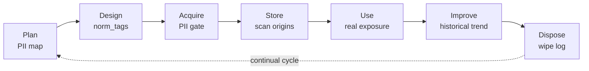

# Primer: data management and governance (DMBOK, ISO/IEC 38505)

<!-- plans-hub-summary: DAMA-DMBOK knowledge areas and ISO/IEC 38505 — where Data Boar sits; not a GDD platform -->

**Status:** Active
**Date:** 2026-08-29
**Authors:** Fabio Leitao
**Priority:** H2
**Depends on:** ADR-0004, ADR-0035, ADR-0050, ADR-0058, ADR-0070
**GitHub:** [#637](https://github.com/DataBoar/data-boar/issues/637)

**Português (Brasil):** [DATA_GOVERNANCE_DMBOK_PRIMER.pt_BR.md](DATA_GOVERNANCE_DMBOK_PRIMER.pt_BR.md)

**Audience:** Data engineers, CDOs, data stewards, and technically minded DPOs who place discovery output inside a **data-management programme**.

**Tone:** Technical. No mascot. No verbatim DAMA wheel, no ISO clause dump. Official starting points: [DAMA Body of Knowledge](https://www.dama.org/cpages/body-of-knowledge), [ISO/IEC 38505](https://www.iso.org/standard/56639.html), [DataOps manifesto](https://dataopsmanifesto.org).

---

## Data management versus data governance (product wording)

**Data management** is the work of planning, storing, integrating, securing, and delivering data so it is fit for use. **Data governance** is the overlay of **decision rights and accountability**: who sets classification, who accepts residual risk, who owns a domain. Governance without management is policy on paper; management without governance is tooling without owners.

Data Boar is **discovery and evidence** for the security, metadata, and (partly) quality conversations. It is **not** a full data-governance platform (GDD), a steward workflow, or a DAMA certification path.

---

## What DMBOK is

**DMBOK** (Data Management Body of Knowledge, DAMA International) is a **practice framework** that organises data-management work around a governance core. It is a **body of knowledge**, not an ISO management-system standard. Use it as a shared vocabulary with stewards and CDOs; do not treat a scan report as “DMBOK compliant.”

---

## Eleven knowledge areas — where this product operates

Labels below are **this repo’s grouping** (core / contributes / context). They are **not** a reproduction of DAMA’s published area names or diagrams.

| Zone | Knowledge area (plain language) | Data Boar role |
| ---- | ------------------------------- | -------------- |
| **Core** | Data governance | `scan_manifest`, GRC-oriented report, auditable session metadata |
| **Core** | Data security | PII/sensitive discovery; exposure by source and pattern type |
| **Core** | Metadata | `norm_tag`, plugin schema, sensitivity profile on findings |
| Contributes | Data architecture | Inventory of configured origins as **input** to architecture work |
| Contributes | Storage and operations | Scans of databases, files, and stream-adjacent targets you configure |
| Contributes | Integration and interoperability | Connectors and plugins per source |
| Contributes | Data quality | Sensitivity profile as **one** quality/risk dimension — not a DQ scorecard |
| Context | Data modelling and design | — (out of product scope) |
| Context | Documents and content | — (except when you point a filesystem/API target at those stores) |
| Context | Reference and master data | — |
| Context | Data warehousing and BI | Optional BI connectors when configured; not a warehouse platform |

---

## Data lifecycle and DataOps / MLOps

A simple **plan → design → acquire → store → use → improve → dispose** loop is enough for operators. Discovery can sit on several arrows: map PII when planning, tag norms when designing, gate risky copies when acquiring, scan stores, observe real exposure in use, trend across sessions, and record wipe/dispose events when the product’s wipe log is used.

Tracked SVG: [databoar_data_lifecycle.svg](../assets/diagrams/databoar_data_lifecycle.svg).

**DataOps / MLOps** (agile delivery of data and model pipelines) **extend** this loop; they do not replace governance. A scanner in CI is a **quality/risk check**, not an MLOps platform. See the DataOps manifesto link above — do not paste manifesto clauses here.

---

## ISO/IEC 38505 — governance *of data*

ISO/IEC 38505 extends the **IT governance** idea of ISO/IEC 38500 into the **data** domain: value of data, risks to treat, alignment of data management with governing-body intent. Catalogue: [ISO/IEC 38505](https://www.iso.org/standard/56639.html). Data Boar **evaluates exposure of sensitive data** in configured systems; it does **not** set data strategy or certify 38505.

IT-governance companion: GitHub [#629](https://github.com/DataBoar/data-boar/issues/629). Legal/compliance page: [COMPLIANCE_AND_LEGAL.md](../COMPLIANCE_AND_LEGAL.md).

---

## What this product is not

- Not a **GDD** (data-governance) suite (no steward inbox, no policy engine, no MDM hub).
- Not a **DMBOK certificate** or DAMA assessment.
- Not a substitute for CDO operating model or ISO/IEC 38505 implementation.

---

## Related product docs

- [COMPLIANCE_AND_LEGAL.md](../COMPLIANCE_AND_LEGAL.md)
- [GLOSSARY.md](../GLOSSARY.md) § *Data governance (DMBOK & lifecycle)*
- ITSM companion: GitHub [#630](https://github.com/DataBoar/data-boar/issues/630)
