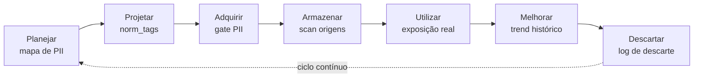

# Primer: gestão e governança de dados (DMBOK, ISO/IEC 38505)

<!-- plans-hub-summary: Áreas DAMA-DMBOK e ISO/IEC 38505 — onde o Data Boar atua; não é plataforma GDD -->

**Status:** Active
**Date:** 2026-08-29
**Authors:** Fabio Leitao
**Priority:** H2
**Depends on:** ADR-0004, ADR-0035, ADR-0050, ADR-0058, ADR-0070
**GitHub:** [#637](https://github.com/DataBoar/data-boar/issues/637)

**English:** [DATA_GOVERNANCE_DMBOK_PRIMER.md](DATA_GOVERNANCE_DMBOK_PRIMER.md)

**Audiência:** engenheiros de dados, CDOs, *data stewards* e DPOs com viés técnico de gestão de dados.

**Tom:** técnico. Sem mascote. Sem roda DAMA verbatim, sem dump de cláusulas ISO. Pontos oficiais: [DAMA Body of Knowledge](https://www.dama.org/cpages/body-of-knowledge), [ISO/IEC 38505](https://www.iso.org/standard/56639.html), [manifesto DataOps](https://dataopsmanifesto.org).

---

## Gestão versus governança de dados (wording do produto)

**Gestão de dados** é o trabalho de planejar, armazenar, integrar, proteger e entregar dados para o uso. **Governança de dados** é a camada de **direitos de decisão e responsabilização**: quem classifica, quem aceita risco residual, quem é dono do domínio. Governança sem gestão é política no papel; gestão sem governança é ferramenta sem dono.

O Data Boar é **descoberta e evidência** para as conversas de segurança, metadados e (em parte) qualidade. **Não** é plataforma completa de governança de dados (GDD), fluxo de steward nem trilha de certificação DAMA.

---

## O que é o DMBOK

O **DMBOK** (Data Management Body of Knowledge, DAMA International) é um **framework de prática** que organiza o trabalho de gestão de dados em torno de um núcleo de governança. É **corpo de conhecimento**, não norma ISO de sistema de gestão. Use como vocabulário compartilhado com stewards e CDO; não trate o relatório de scan como “conforme DMBOK”.

---

## Onze áreas de conhecimento — onde este produto opera

Os rótulos abaixo são **agrupamento deste repositório** (núcleo / contribui / contexto). **Não** reproduzem nomes ou diagramas publicados pela DAMA.

| Zona | Área (linguagem simples) | Papel do Data Boar |
| ---- | ------------------------ | ------------------ |
| **Núcleo** | Governança de dados | `scan_manifest`, relatório orientado a GRC, metadados de sessão auditáveis |
| **Núcleo** | Segurança de dados | Descoberta de PII/sensíveis; exposição por fonte e tipo de padrão |
| **Núcleo** | Metadados | `norm_tag`, schema de plugin, perfil de sensibilidade nos achados |
| Contribui | Arquitetura de dados | Inventário das origens configuradas como **insumo** à arquitetura |
| Contribui | Armazenamento e operação | Scan de bancos, arquivos e alvos adjacentes a stream que você configurar |
| Contribui | Integração e interoperabilidade | Conectores e plugins por fonte |
| Contribui | Qualidade de dados | Perfil de sensibilidade como **uma** dimensão de qualidade/risco — não scorecard de DQ |
| Contexto | Modelagem e projeto | — (fora do escopo do produto) |
| Contexto | Documentos e conteúdo | — (exceto se você apontar filesystem/API para esses acervos) |
| Contexto | Dados de referência e mestre | — |
| Contexto | Data warehouse e BI | Conectores de BI opcionais quando configurados; não é plataforma de DW |

---

## Ciclo de vida e DataOps / MLOps

Um ciclo simples **planejar → projetar → adquirir → armazenar → utilizar → melhorar → descartar** basta para o operador. A descoberta pode sentar em várias setas: mapear PII no planejamento, marcar normas no projeto, barrar cópias arriscadas na aquisição, varrer origens, observar exposição real no uso, tendência entre sessões e registrar descarte quando o log de wipe do produto for usado.

SVG: [databoar_data_lifecycle.svg](../assets/diagrams/databoar_data_lifecycle.svg).

**DataOps / MLOps** (entrega ágil de dados e pipelines de modelo) **estendem** esse ciclo; não substituem governança. Scanner no CI é **checagem de qualidade/risco**, não plataforma MLOps. Veja o manifesto DataOps — não cole cláusulas do manifesto aqui.

---

## ISO/IEC 38505 — governança *de dados*

A ISO/IEC 38505 estende a ideia de governança de TI da ISO/IEC 38500 ao domínio **dados**: valor dos dados, riscos a tratar, alinhamento da gestão de dados à intenção do órgão de governança. Catálogo: [ISO/IEC 38505](https://www.iso.org/standard/56639.html). O Data Boar **avalia exposição de dados sensíveis** nos sistemas configurados; **não** define estratégia de dados nem certifica 38505.

Companion de governança de TI: GitHub [#629](https://github.com/DataBoar/data-boar/issues/629). Página jurídico/compliance: [COMPLIANCE_AND_LEGAL.pt_BR.md](../COMPLIANCE_AND_LEGAL.pt_BR.md).

---

## O que este produto não é

- Não é suíte **GDD** (sem caixa de steward, sem motor de política, sem hub MDM).
- Não é **certificado DMBOK** nem avaliação DAMA.
- Não substitui modelo operacional de CDO nem implementação ISO/IEC 38505.

---

## Docs relacionados

- [COMPLIANCE_AND_LEGAL.pt_BR.md](../COMPLIANCE_AND_LEGAL.pt_BR.md)
- [GLOSSARY.pt_BR.md](../GLOSSARY.pt_BR.md) § *Governança de dados (DMBOK e ciclo de vida)*
- Companion ITSM: GitHub [#630](https://github.com/DataBoar/data-boar/issues/630)
