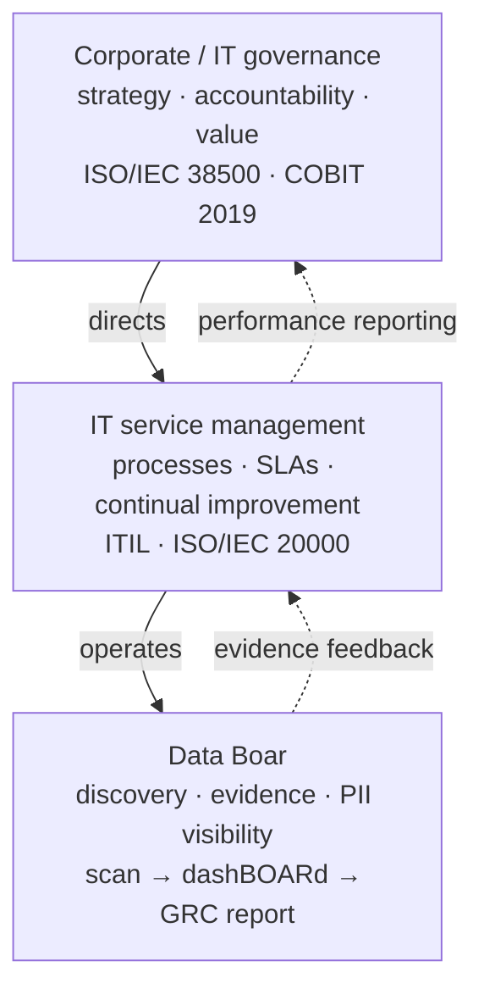
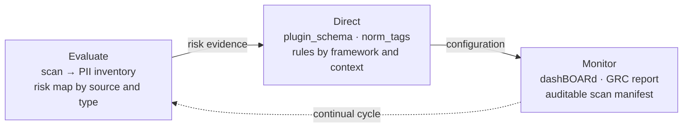

# Primer: IT governance frameworks (ISO/IEC 38500, COBIT 2019)

<!-- plans-hub-summary: ISO/IEC 38500 and COBIT 2019 — EDM cycle; Data Boar as discovery evidence, not a GRC suite -->

**Status:** Active
**Date:** 2026-08-29
**Authors:** Fabio Leitao
**Priority:** H2
**Depends on:** ADR-0004, ADR-0035, ADR-0050, ADR-0058, ADR-0070
**GitHub:** [#629](https://github.com/DataBoar/data-boar/issues/629)

**Português (Brasil):** [IT_GOVERNANCE_FRAMEWORKS_PRIMER.pt_BR.md](IT_GOVERNANCE_FRAMEWORKS_PRIMER.pt_BR.md)

**Audience:** Compliance engineers, integrators, and IT-governance managers who need a vendor-neutral map of **where discovery evidence sits** in an executive governance cycle.

**Tone:** Technical explainer. No product mascot, no marketing slogans. This page does **not** reproduce ISO or ISACA normative text or tables; buy those publications if you need the official wording.

---

## Why IT governance matters for data discovery

Governing bodies are accountable for whether technology creates **value**, stays inside **risk appetite**, and remains **traceable**. Discovery of personal and sensitive data is not an IT hobby: it is an input to those questions. If nobody can show **where** identifiers sit in configured stores, Evaluate/Direct/Monitor becomes theatre.

Data Boar is the **operational discovery layer**: configured targets, bounded reads, metadata-only findings, dashBOARd status, and GRC-oriented reports. It does **not** replace board charters, COBIT process catalogues, or an enterprise GRC platform.

---

## Governance stack — where the product operates

Corporate governance **directs** service management; service management **runs** tools; tools **feed evidence** back up the stack.

Tracked SVG: [databoar_governance_stack.svg](../assets/diagrams/databoar_governance_stack.svg).

---

## EDM cycle (Evaluate → Direct → Monitor)

ISO/IEC 38500 describes how the **governing body** steers the use of IT: **evaluate** current and future use, **direct** preparation and implementation of policies, **monitor** conformance and performance. Catalogue entry: [ISO/IEC 38500](https://www.iso.org/standard/62816.html). Brazil: purchase **ABNT NBR ISO/IEC 38500** from ABNT — do not copy tables from that text here.

How this product maps (operator wording, not a certified mapping):

| EDM step | What the governing body typically asks | What Data Boar can supply |
| -------- | -------------------------------------- | ------------------------- |
| **Evaluate** | What sensitive data exists, where, and how exposed is it? | Scan sessions, inventory-style findings, risk/heatmap views by source and pattern |
| **Direct** | What rules and scope should operators apply? | Config (`targets`, `norm_tag` / plugin patterns, sampling limits), not a policy-management suite |
| **Monitor** | Did we stay inside the directed scope? What changed? | dashBOARd / API status, Excel + optional `scan_manifest`, session-over-session comparison |

Tracked SVG: [databoar_edm_cycle.svg](../assets/diagrams/databoar_edm_cycle.svg).

COBIT 2019 materials (open overview, not a dump of the proprietary framework): [ISACA — COBIT](https://www.isaca.org/resources/cobit).

---

## Five COBIT-oriented design ideas (product wording)

These bullets are **this repo’s paraphrase** of themes commonly associated with COBIT 2019. They are **not** an ISACA control list and **must not** be cited as official COBIT text.

1. **Stakeholder outcomes first** — technology work is judged by whether it supports agreed organisational outcomes, not by tool count.
2. **Enterprise-wide, not a silo** — data exposure in a share or CRM is still an enterprise issue even if “IT did not own the app.”
3. **One coherent language** — mix ISO, COBIT, and local policy only with an explicit map; this primer does not provide that map for your organisation.
4. **People, process, and information together** — a scanner without owners, tickets, and retention rules does not “do governance.”
5. **Governance is not operations** — EDM (directing and monitoring) is distinct from running scans, SLAs, and incident queues (see the ITSM companion, GitHub **#630**).

---

## What this product is not

- Not a **GRC platform** (no control library, no certification workflow, no board pack generator that replaces your GRC vendor).
- Not an **accredited assessment** against ISO/IEC 38500 or COBIT.
- Not a substitute for **counsel**, internal audit, or ISACA/ISO training.

---

## Related product docs

- [COMPLIANCE_METHODOLOGY.md](../COMPLIANCE_METHODOLOGY.md) — verification modules and ROPA-style priorities
- [DECISION_MAKER_VALUE_BRIEF.md](../DECISION_MAKER_VALUE_BRIEF.md) — leadership/legal briefing
- [ITSM_GOVERNANCE_ALIGNMENT.md](../ITSM_GOVERNANCE_ALIGNMENT.md) — shipped alignment tables (ITIL / COBIT / ISO 38500 / 20000)
- [GLOSSARY.md](../GLOSSARY.md) § *IT governance and service management*
- Companion primer (ITSM): GitHub [#630](https://github.com/DataBoar/data-boar/issues/630) (file `docs/plans/ITSM_FRAMEWORKS_PRIMER.md` — path only, ADR-0004)
