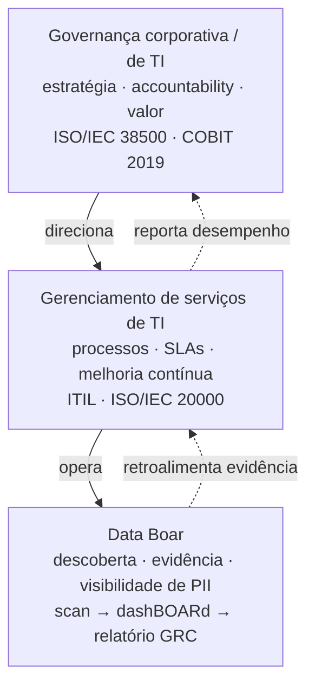
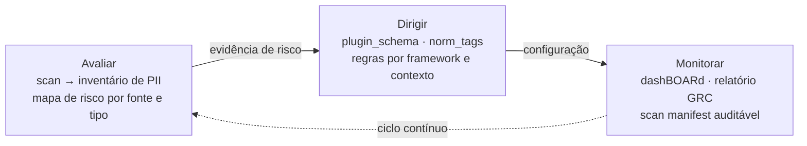

# Primer: frameworks de governança de TI (ISO/IEC 38500, COBIT 2019)

<!-- plans-hub-summary: ISO/IEC 38500 e COBIT 2019 — ciclo EDM; Data Boar como evidência de descoberta, não suite GRC -->

**Status:** Active
**Date:** 2026-08-29
**Authors:** Fabio Leitao
**Priority:** H2
**Depends on:** ADR-0004, ADR-0035, ADR-0050, ADR-0058, ADR-0070
**GitHub:** [#629](https://github.com/DataBoar/data-boar/issues/629)

**English:** [IT_GOVERNANCE_FRAMEWORKS_PRIMER.md](IT_GOVERNANCE_FRAMEWORKS_PRIMER.md)

**Audiência:** engenheiros de compliance, integradores e gestores de governança de TI que precisam de um mapa neutro de **onde a evidência de descoberta entra** no ciclo executivo.

**Tom:** texto técnico. Sem mascote, sem slogan. Esta página **não** reproduz texto ou tabelas normativas ISO ou ISACA; adquira as publicações oficiais se precisar da redação canônica.

---

## Por que governança de TI importa para descoberta de dados

O órgão de governança responde se a tecnologia gera **valor**, cabe no **apetite de risco** e permanece **rastreável**. Descobrir dados pessoais e sensíveis não é hobby de TI: é insumo dessas perguntas. Sem mostrar **onde** identificadores estão nos alvos configurados, Avaliar/Dirigir/Monitorar vira teatro.

O Data Boar é a **camada operacional de descoberta**: alvos configurados, leituras delimitadas, achados só com metadados, status no dashBOARd e relatórios orientados a GRC. **Não** substitui estatuto de conselho, catálogo de processos COBIT nem plataforma GRC corporativa.

---

## Pilha de governança — onde o produto opera

A governança corporativa **direciona** o gerenciamento de serviços; o gerenciamento de serviços **opera** as ferramentas; as ferramentas **devolvem evidência** para cima.

SVG no repositório: [databoar_governance_stack.svg](../assets/diagrams/databoar_governance_stack.svg).

---

## Ciclo EDM (Avaliar → Dirigir → Monitorar)

A ISO/IEC 38500 descreve como o **órgão de governança** conduz o uso de TI: **avaliar** uso atual e futuro, **dirigir** preparação e implementação de políticas, **monitorar** conformidade e desempenho. Catálogo: [ISO/IEC 38500](https://www.iso.org/standard/62816.html). Brasil: adquirir **ABNT NBR ISO/IEC 38500** na loja ABNT — não copie tabelas da norma aqui.

Mapeamento do produto (wording do operador, não mapeamento certificado):

| Etapa EDM | O que a alta direção costuma perguntar | O que o Data Boar pode fornecer |
| --------- | -------------------------------------- | ------------------------------- |
| **Avaliar** | Que dados sensíveis existem, onde, e quão expostos estão? | Sessões de scan, achados tipo inventário, visões de risco/heatmap por fonte e padrão |
| **Dirigir** | Quais regras e escopo os operadores devem aplicar? | Config (`targets`, `norm_tag` / plugins, limites de amostragem), não uma suíte de gestão de políticas |
| **Monitorar** | Permanecemos no escopo dirigido? O que mudou? | dashBOARd / API status, Excel + `scan_manifest` opcional, comparação entre sessões |

SVG: [databoar_edm_cycle.svg](../assets/diagrams/databoar_edm_cycle.svg).

Materiais abertos COBIT 2019 (visão geral, sem dump do framework proprietário): [ISACA — COBIT](https://www.isaca.org/resources/cobit).

---

## Cinco ideias de desenho no espírito COBIT (wording do produto)

Estes itens são **paráfrase deste repositório** de temas associados ao COBIT 2019. **Não** são lista oficial de controles ISACA e **não** devem ser citados como texto COBIT.

1. **Resultado para partes interessadas primeiro** — o trabalho de tecnologia se julga pelo desfecho acordado, não pela quantidade de ferramentas.
2. **Empresa inteira, não silo** — exposição em um share ou CRM continua sendo problema da organização mesmo se “TI não era dona do app”.
3. **Uma linguagem coerente** — misture ISO, COBIT e política local só com um mapa explícito; este primer não faz esse mapa pela sua empresa.
4. **Pessoas, processo e informação juntos** — scanner sem donos, tickets e regras de retenção não “faz governança”.
5. **Governança não é operação** — EDM (dirigir e monitorar) é distinto de rodar scans, SLAs e filas de incidente (companion ITSM, GitHub **#630**).

---

## O que este produto não é

- Não é **plataforma GRC** (sem biblioteca de controles, sem fluxo de certificação, sem gerador de board pack no lugar do seu GRC).
- Não é **avaliação acreditada** contra ISO/IEC 38500 ou COBIT.
- Não substitui **assessoria jurídica**, auditoria interna nem formação ISACA/ISO.

---

## Docs relacionados

- [COMPLIANCE_METHODOLOGY.pt_BR.md](../COMPLIANCE_METHODOLOGY.pt_BR.md) — módulos de verificação e prioridades estilo ROPA
- [DECISION_MAKER_VALUE_BRIEF.pt_BR.md](../DECISION_MAKER_VALUE_BRIEF.pt_BR.md) — briefing para liderança/jurídico
- [ITSM_GOVERNANCE_ALIGNMENT.pt_BR.md](../ITSM_GOVERNANCE_ALIGNMENT.pt_BR.md) — tabelas de alinhamento já publicadas
- [GLOSSARY.pt_BR.md](../GLOSSARY.pt_BR.md) § *Governança de TI e gerenciamento de serviços*
- Companion ITSM: GitHub [#630](https://github.com/DataBoar/data-boar/issues/630) (arquivo `docs/plans/ITSM_FRAMEWORKS_PRIMER.md` — só o caminho, ADR-0004)
