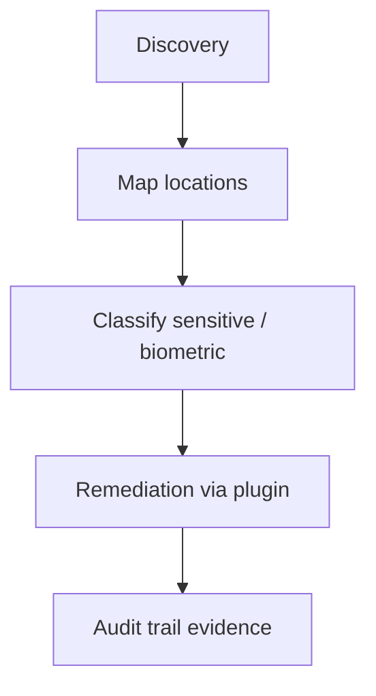

# Use case — Biometric data protection

**Português (Brasil):** [USE_CASE_BIOMETRIC_DATA_PROTECTION.pt_BR.md](USE_CASE_BIOMETRIC_DATA_PROTECTION.pt_BR.md)

**Illustrative only** — not legal advice. Biometric processing rules vary by sector and jurisdiction—engage counsel.

---

## Why biometrics are different

- **Non-resettable:** unlike passwords, compromised biometrics cannot be rotated by the data subject.
- **LGPD Art. 11** — sensitive personal data; consent or narrow legal bases.
- **GDPR Art. 9** — special categories; general prohibition with specific exceptions.
- **Incident impact** — breach may be **permanent** for the individual; prioritise discovery and hardening early.

---

## Sectors and typical locations

| Sector | Biometric type | Where it often appears |
| ------ | -------------- | ---------------------- |
| HR / time tracking | Fingerprint, facial | Time-clock DB, backups, vendor exports |
| Healthcare | Iris, facial (ID) | PACS/imaging storage, EHR attachments |
| Financial services | Voice (auth), facial | Call recordings, KYC onboarding stores |
| Retail | Facial (CCTV analytics) | NVR storage, analytics buckets |
| Public sector | Fingerprint, facial, iris | Identity systems, border/permit archives |

---

## What Data Boar delivers (workflow)

1. **Discovery** — scan configured databases, filesystems, and API exports for biometric-related patterns and adjacent identifiers.
1. **Mapping** — findings name exact table/column/file paths for remediation planning.
1. **Classification** — flag sensitive-category context for LGPD/GDPR workshops (detector + policy labels as shipped).
1. **Remediation** — Enterprise plugin applies field encryption, vaultless tokenization, or access removal per [USE_CASE_SCAN_AND_REMEDIATE.md](USE_CASE_SCAN_AND_REMEDIATE.md).
1. **Evidence** — immutable audit trail supports before/after demonstrations to DPO and auditors.

---

## Regulations often cited

| Framework | Relevance |
| --------- | --------- |
| **LGPD Art. 11** | Sensitive data; consent and legal bases |
| **GDPR Art. 9** | Special categories |
| **ANPD** incident guidance | Sensitive-data breaches may trigger notification analysis |
| **ISO/IEC 27701** Annex B.8.4 | Privacy impact themes for sensitive categories |

---

## Partner and sales angle

Lead with **“you cannot rotate a fingerprint”** — discovery is the first defensible step before buying more cameras or clocks. Pair with [README.md](README.md) sector storyboards (health, HR, government) for workshop narrative.

---

## Related docs

- [USE_CASES_HUB.md](USE_CASES_HUB.md) ([pt-BR](USE_CASES_HUB.pt_BR.md))
- [USE_CASE_SCAN_AND_REMEDIATE.md](USE_CASE_SCAN_AND_REMEDIATE.md) ([pt-BR](USE_CASE_SCAN_AND_REMEDIATE.pt_BR.md))
- [SENSITIVITY_DETECTION.md](../SENSITIVITY_DETECTION.md) ([pt-BR](../SENSITIVITY_DETECTION.pt_BR.md))
