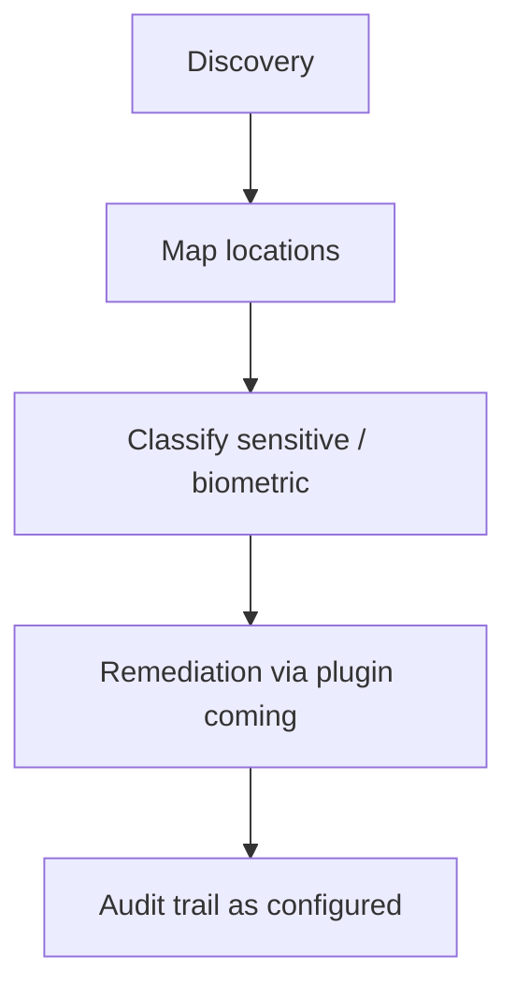

# Use case — Biometric data protection

**Português (Brasil):** [USE_CASE_BIOMETRIC_DATA_PROTECTION.pt_BR.md](USE_CASE_BIOMETRIC_DATA_PROTECTION.pt_BR.md)

**Illustrative only** — not legal advice. Biometric processing rules vary by sector and jurisdiction—engage counsel.

---

## Why biometrics are different

- **Non-resettable:** unlike passwords, compromised biometrics cannot be rotated by the data subject.
- **LGPD Art. 11** — sensitive personal data; consent or narrow legal bases.
- **GDPR Art. 9** — special categories; general prohibition with specific exceptions.
- **Incident impact** — breach may be **permanent** for the individual; prioritise discovery and hardening early.

---

## Sectors and typical locations

| Sector | Biometric type | Where it often appears |
| ------ | -------------- | ---------------------- |
| HR / time tracking | Fingerprint, facial | Time-clock DB, backups, vendor exports |
| Healthcare | Iris, facial (ID) | PACS/imaging storage, EHR attachments |
| Financial services | Voice (auth), facial | Call recordings, KYC onboarding stores |
| Retail | Facial (CCTV analytics) | NVR storage, analytics buckets |
| Public sector | Fingerprint, facial, iris | Identity systems, border/permit archives |

---

## What Data Boar delivers (workflow)

```mermaid
flowchart TD
  D[Discovery] --> M[Map locations]
  M --> C[Classify sensitive / biometric]
  C --> R[Remediation via plugin coming]
  R --> E[Audit trail as configured]
```

1. **Discovery** — scan configured databases, filesystems, and API exports for biometric-related patterns and adjacent identifiers.
1. **Mapping** — findings name exact table/column/file paths for remediation planning.
1. **Classification** — flag sensitive-category context for LGPD/GDPR workshops (detector + policy labels as shipped).
1. **Remediation** — Enterprise plugin (**coming**) applies field encryption, **vaultless tokenization**, or access removal per [USE_CASE_SCAN_AND_REMEDIATE.md](USE_CASE_SCAN_AND_REMEDIATE.md) ([pt-BR](USE_CASE_SCAN_AND_REMEDIATE.pt_BR.md)). For stored biometric templates, vaultless tokenization is a strong **at-rest** fit: the stored representation is protected, and **key rotation** (where the plugin supports it) stands in for credential rotation — which the data subject cannot perform. A generic token is **not** a live biometric: matching still needs a designed control. Data Boar does not ship a matcher or a biometric algorithm.
1. **Evidence** — discovery and mapping evidence is what Data Boar ships today. A before/after demonstration after remediation is part of the **coming** Enterprise loop (re-scan + configured audit trail); this use-case does **not** claim a WORM store or a shipped remediator.

---

## Regulations often cited

| Framework | Relevance |
| --------- | --------- |
| **LGPD Art. 11** | Sensitive data; consent and legal bases |
| **GDPR Art. 9** | Special categories |
| **ANPD** incident guidance | Sensitive-data breaches may trigger notification analysis |
| **ISO/IEC 27701** Annex B.8.4 | Privacy impact themes for sensitive categories |

---

## Why vaultless tokenization matters for non-resettable data

Passwords can be reset. Biometrics cannot.

When a stored biometric template is compromised, the data subject has no self-service remediation path — the exposure is lasting. That makes **preventive protection of stored copies** before a breach the defensible workshop posture; discovery alone does not harden the store.

Vaultless tokenization, as a **method** applied at the stored-template level (Enterprise plugin, **coming**):

- Protects the representation without a **vault lookup table** (no second token database as a second breach target).
- Can keep **field shape** for inventory, exports, and adjacent identifiers; **matching** is not automatic — a generic token is not a fingerprint.
- Allows **key rotation** where the plugin design supports it — rotating keys can invalidate previously issued tokens without re-collecting biometrics from subjects.
- Can produce an **audit trail** of when protection was applied, by which plugin, and confirmed by re-scan — not a WORM store unless the deployment adds one.

This is workshop language for **sensitive-category** processing under **LGPD Art. 11** and **GDPR Art. 9**, plus **technical evidence** that a safeguard was applied — not only that templates were discovered. Counsel maps security-measure duties (often **LGPD Art. 46** / **GDPR Art. 32**, or GDPR Art. 9 “appropriate safeguards” where that exception applies).

---

## Partner and sales angle

Lead with **“you cannot rotate a fingerprint”** — discovery is the first defensible step before buying more cameras or clocks. Pair with [README.md](README.md) sector storyboards (health, HR, government) for workshop narrative. See **Why vaultless tokenization matters for non-resettable data** above for the LGPD Art. 11 / GDPR Art. 9 technical argument — it translates into procurement language for HR tech, healthcare, and financial services buyers.

---

## Related docs

- [USE_CASES_HUB.md](USE_CASES_HUB.md) ([pt-BR](USE_CASES_HUB.pt_BR.md))
- [USE_CASE_SCAN_AND_REMEDIATE.md](USE_CASE_SCAN_AND_REMEDIATE.md) ([pt-BR](USE_CASE_SCAN_AND_REMEDIATE.pt_BR.md))
- [SENSITIVITY_DETECTION.md](../SENSITIVITY_DETECTION.md) ([pt-BR](../SENSITIVITY_DETECTION.pt_BR.md))
