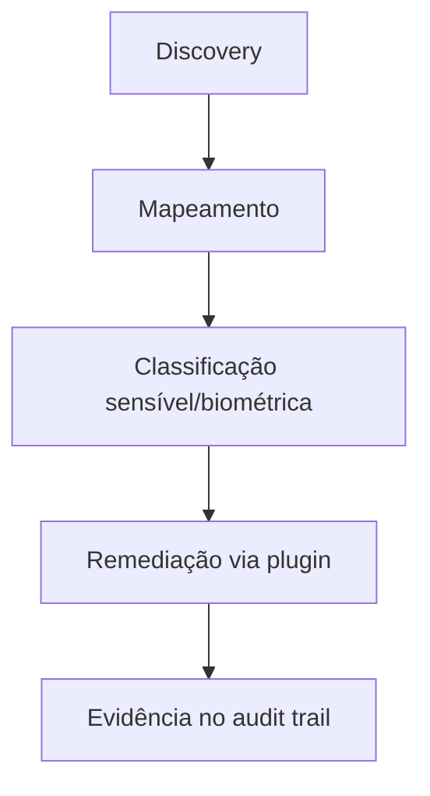

# Use case — Proteção de dados biométricos

**English:** [USE_CASE_BIOMETRIC_DATA_PROTECTION.md](USE_CASE_BIOMETRIC_DATA_PROTECTION.md)

**Somente ilustrativo** — não é assessoria jurídica. Regras de tratamento biométrico variam por setor e jurisdição — envolva o jurídico.

---

## Por que biometria é diferente

- **Não resetável:** diferente de senha, biometria comprometida não é trocada pelo titular.
- **LGPD art. 11** — dado pessoal sensível; consentimento ou bases legais restritas.
- **GDPR art. 9** — categorias especiais; proibição geral com exceções taxativas.
- **Impacto de incidente** — vazamento pode ser **permanente** para a pessoa; priorize discovery e endurecimento cedo.

---

## Setores e locais típicos

| Setor | Tipo biométrico | Onde costuma aparecer |
| ----- | --------------- | --------------------- |
| RH / ponto | Digital, facial | BD de relógio, backups, export do fornecedor |
| Saúde | Íris, facial (ID) | PACS/armazenamento de imagem, anexos de prontuário |
| Serviços financeiros | Voz (auth), facial | Gravações de call center, stores de KYC |
| Varejo | Facial (analytics de CFTV) | NVR, buckets de analytics |
| Setor público | Digital, facial, íris | Sistemas de identidade, arquivo de fronteira |

---

## O que o Data Boar entrega (fluxo)

1. **Discovery** — scan em bases, filesystems e exportações de API configurados.
1. **Mapeamento** — findings nomeiam tabela/coluna/caminho exatos para planejamento.
1. **Classificação** — contexto de categoria sensível para workshops LGPD/GDPR.
1. **Remediação** — plugin Enterprise conforme [USE_CASE_SCAN_AND_REMEDIATE.pt_BR.md](USE_CASE_SCAN_AND_REMEDIATE.pt_BR.md).
1. **Evidência** — audit trail imutável para demonstração a DPO e auditores.

---

## Regulações citadas com frequência

| Framework | Relevância |
| --------- | ----------- |
| **LGPD art. 11** | Dado sensível; consentimento e bases legais |
| **GDPR art. 9** | Categorias especiais |
| **Orientações ANPD** | Incidentes com dados sensíveis podem exigir análise de notificação |
| **ISO/IEC 27701** anexo B.8.4 | Temas de DPIA para categorias sensíveis |

---

## Ângulo comercial

Abra com **“não dá para trocar a digital”** — discovery é o primeiro passo defensável antes de comprar mais câmeras ou relógios. Combine com storyboards em [README.pt_BR.md](README.pt_BR.md) (saúde, RH, governo).

---

## Documentos relacionados

- [USE_CASES_HUB.pt_BR.md](USE_CASES_HUB.pt_BR.md)
- [USE_CASE_SCAN_AND_REMEDIATE.pt_BR.md](USE_CASE_SCAN_AND_REMEDIATE.pt_BR.md)
- [SENSITIVITY_DETECTION.pt_BR.md](../SENSITIVITY_DETECTION.pt_BR.md)
