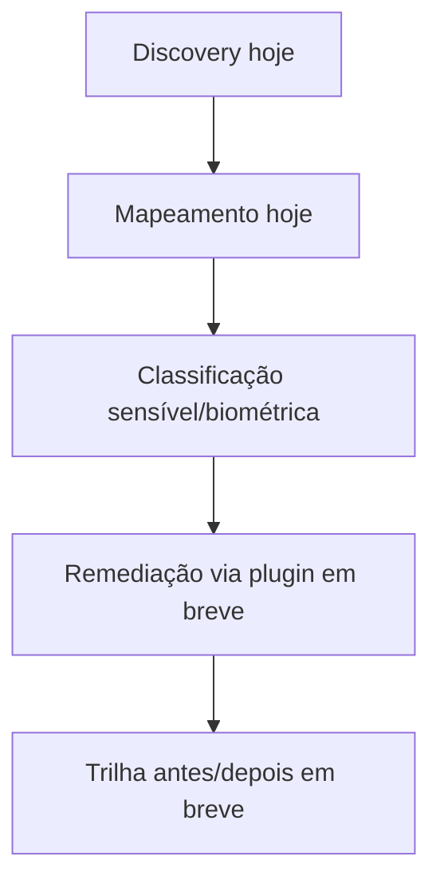

# Use case — Proteção de dados biométricos

**English:** [USE_CASE_BIOMETRIC_DATA_PROTECTION.md](USE_CASE_BIOMETRIC_DATA_PROTECTION.md)

**Somente ilustrativo** — não é assessoria jurídica. Regras de tratamento biométrico variam por setor e jurisdição — envolva o jurídico.

---

## Por que biometria é diferente

- **Não resetável:** diferente de senha, biometria comprometida não é trocada pelo titular.
- **LGPD art. 11** — dado pessoal sensível; consentimento ou bases legais restritas.
- **GDPR art. 9** — categorias especiais; proibição geral com exceções taxativas.
- **Impacto de incidente** — vazamento pode ser **permanente** para a pessoa; priorize discovery e endurecimento cedo.

---

## Setores e locais típicos

| Setor | Tipo biométrico | Onde costuma aparecer |
| ----- | --------------- | --------------------- |
| RH / ponto | Digital, facial | BD de relógio, backups, export do fornecedor |
| Saúde | Íris, facial (ID) | PACS/armazenamento de imagem, anexos de prontuário |
| Serviços financeiros | Voz (auth), facial | Gravações de call center, stores de KYC |
| Varejo | Facial (analytics de CFTV) | NVR, buckets de analytics |
| Setor público | Digital, facial, íris | Sistemas de identidade, arquivo de fronteira |

---

## O que o Data Boar entrega (fluxo)

```mermaid
flowchart TD
  D[Discovery hoje] --> M[Mapeamento hoje]
  M --> C[Classificação sensível/biométrica]
  C --> R[Remediação via plugin em breve]
  R --> E[Trilha antes/depois em breve]
```

1. **Discovery** — scan em bases, filesystems e exportações de API configurados.
1. **Mapeamento** — findings nomeiam tabela/coluna/caminho exatos para planejamento.
1. **Classificação** — contexto de categoria sensível para workshops LGPD/GDPR.
1. **Remediação** — plugin Enterprise (**em breve**) aplica criptografia de campo, **tokenização vaultless** ou remoção de acesso conforme [USE_CASE_SCAN_AND_REMEDIATE.pt_BR.md](USE_CASE_SCAN_AND_REMEDIATE.pt_BR.md) ([EN](USE_CASE_SCAN_AND_REMEDIATE.md)). Para templates biométricos armazenados, tokenização vaultless é um encaixe forte **em repouso**: a representação fica protegida, e a **rotação de chave** (quando o plugin oferece) substitui a rotação de credencial — que o titular não consegue fazer. Um token genérico **não** é biometria ao vivo: o matching ainda precisa de um controle desenhado. O Data Boar não entrega matcher nem algoritmo biométrico.
1. **Evidência** — descoberta e mapeamento são o que o Data Boar entrega hoje. Demonstração antes/depois após remediação faz parte do ciclo Enterprise **em breve** (nova varredura + trilha de auditoria configurada); este use-case **não** afirma um repositório WORM nem um remediador já enviado.

---

## Regulações citadas com frequência

| Framework | Relevância |
| --------- | ----------- |
| **LGPD art. 11** | Dado sensível; consentimento e bases legais |
| **GDPR art. 9** | Categorias especiais |
| **Orientações ANPD** | Incidentes com dados sensíveis podem exigir análise de notificação |
| **ISO/IEC 27701** anexo B.8.4 | Temas de DPIA para categorias sensíveis |

---

## Por que tokenização vaultless importa para dados não resetáveis

Senha pode ser resetada. Biometria não.

Quando um template biométrico armazenado é comprometido, o titular não tem caminho de remediação por autoatendimento — a exposição é duradoura. Isso torna a **proteção preventiva das cópias armazenadas** antes de um incidente a postura defensável em workshop; só descobrir o dado não endurece o armazenamento.

Tokenização vaultless, como **método** no nível do template armazenado (plugin Enterprise, **em breve**):

- Protege a representação sem **tabela de lookup em cofre** (não cria um segundo banco de tokens como segundo alvo de incidente).
- Pode manter o **formato do campo** para inventário, exportações e identificadores adjacentes; o **matching** não é automático — um token genérico não é uma digital.
- Permite **rotação de chave** quando o desenho do plugin oferece — rotacionar chaves pode invalidar tokens já emitidos sem recoletar biometria dos titulares.
- Pode produzir uma **trilha de auditoria** de quando a proteção foi aplicada, por qual plugin, e confirmada por nova varredura — não é um repositório WORM salvo se o deployment acrescentar um.

Isso é linguagem de workshop para tratamento de **categoria sensível** sob **LGPD art. 11** e **GDPR art. 9**, mais **evidência técnica** de que uma salvaguarda foi aplicada — não só de que templates foram descobertos. O jurídico mapeia deveres de medida de segurança (em geral **LGPD art. 46** / **GDPR art. 32**, ou as “appropriate safeguards” do GDPR art. 9 quando essa exceção vale).

---

## Ângulo comercial

Abra com **“não dá para trocar a digital”** — discovery é o primeiro passo defensável antes de comprar mais câmeras ou relógios. Combine com storyboards em [README.pt_BR.md](README.pt_BR.md) (saúde, RH, governo). Veja **Por que tokenização vaultless importa para dados não resetáveis** acima para o argumento técnico LGPD art. 11 / GDPR art. 9 — ele vira linguagem de compras para HR tech, saúde e serviços financeiros.

---

## Documentos relacionados

- [USE_CASES_HUB.pt_BR.md](USE_CASES_HUB.pt_BR.md)
- [USE_CASE_SCAN_AND_REMEDIATE.pt_BR.md](USE_CASE_SCAN_AND_REMEDIATE.pt_BR.md)
- [SENSITIVITY_DETECTION.pt_BR.md](../SENSITIVITY_DETECTION.pt_BR.md)
