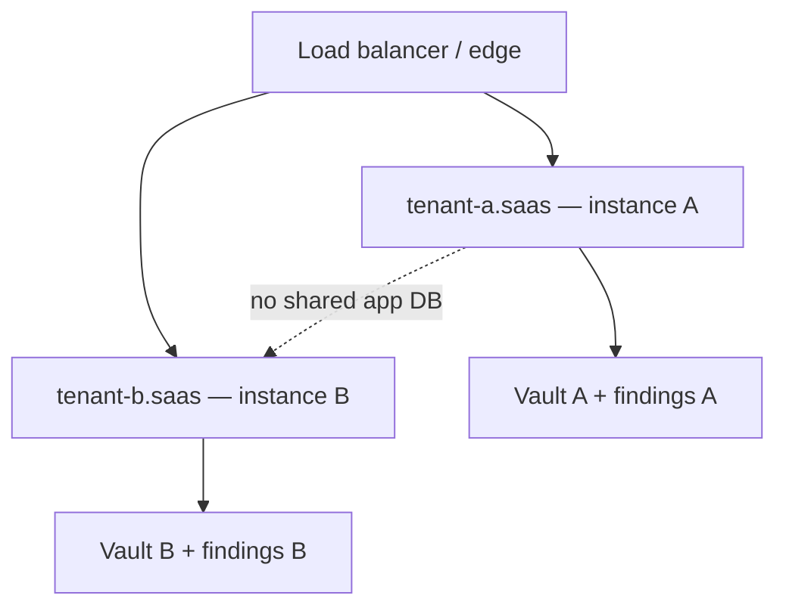

# Use case — Managed / SaaS multi-tenant deployment

**Português (Brasil):** [USE_CASE_MANAGED_SAAS_MULTI_TENANT.pt_BR.md](USE_CASE_MANAGED_SAAS_MULTI_TENANT.pt_BR.md)

**Illustrative only** — not legal advice and not a hosting SLA. Air-gapped / on-prem remains the **recommended** default; managed / SaaS is **opt-in** for organisations that prefer a hosted control plane.

**Adjacent angle (different buyer):** [MSP_IT_CONSULTANCY_MULTI_TENANT_SMB.md](MSP_IT_CONSULTANCY_MULTI_TENANT_SMB.md) — an MSP scans **its own** SMB clients with repeatable playbooks. This use case is the **managed SaaS plane we operate** for a customer organisation (one tenant = one customer tenancy).

---

## Market gap

> We want discovery without standing up our own stack—and without shipping raw customer data to a shared multi-tenant black box.

| Today (typical) | With managed Data Boar (this model) |
| ----------------- | ----------------------------------- |
| DIY on-prem only, or shared SaaS where tenancy is “RBAC on one cluster” | Subdomain → **dedicated instance** behind a load balancer; BYO-cloud runner keeps raw data in the customer tenancy; findings return as **location metadata** |

---

## Isolation by architecture (not by RBAC alone)

**Hard default:** each customer subdomain (`<customer>.<saas-domain>`) fronts **its own isolated instance** (VM or container behind a load balancer). Cross-tenant data leakage is **architecturally impossible** in this model—not merely “blocked by RBAC.”

| Layer | Role |
| ----- | ---- |
| **Subdomain** | Operator/customer entry URL scoped to that tenancy |
| **Instance** | Dedicated compute + storage + credential vault for that tenant |
| **RBAC (inside the instance)** | Who may see which targets/reports **within** that customer’s instance |

**RBAC tiers (inside one customer instance):**

| Edition posture | RBAC shape (illustrative) |
| --------------- | ------------------------- |
| **Pro** | Fixed role set |
| **Pro+** | Custom roles |
| **Enterprise** | Per-resource scopes + SSO |

**Future density option (not the default):** shared-machine multi-tenancy with strong RBAC and partition walls. Document that path as an **evolution** for higher density; do **not** present it as the managed default while GTM leads with architectural isolation.

---

## Runner placement

| Mode | Where the scan runs | What leaves the customer tenancy |
| ---- | ------------------- | -------------------------------- |
| **BYO-cloud** | VM / compute **in the customer’s cloud** | **Findings metadata only** (paths, tables, columns, finding ids)—**raw customer data never leaves** their tenancy. Control plane may stay hosted. |
| **Hosted** | Provider compute that is **ephemeral and hardened** | Same findings-metadata contract; raw samples must not persist in swap, logs, or dumps |

**No-retention posture:** the product **reads → detects → reports findings (location metadata) → discards raw**. Findings are the **where**, not the **what**—they are still confidential / recon-sensitive and must stay **tenant-isolated**.

---

## Why a customer would choose it

### Discretion / shadow-IT without espionage theatre

CISO / DPO can run discovery with less friction against internal IT ticket queues, while visibility stays **RBAC-gated** and every privileged action lands on an **immutable Audit Trail**. That is a **mandate with discretion and auditability**—not covert surveillance of coworkers.

### SaaS-target auditing

Scan services the organisation already runs in the cloud (examples: Google Workspace, HubSpot, HRIS) **via those vendors’ APIs**, from the managed plane, with **per-tenant credential custody** (below).

### Global differential — multi-locale and multi-encoding for real

Call this out explicitly for buyers and partners:

- **Bilingual (and beyond) by design** — product surfaces and operator docs support more than one language; additional locales can be brought online in **minutes**, not a multi-quarter rewrite.
- **Real locale + encoding** — detection and reporting respect actual character encodings and locale conventions so the same platform serves **any customer language** wherever they operate.
- That capability is what makes a **global** managed SaaS / consultancy model defensible—not a single-locale scanner with a translated marketing page.

---

## Credential custody (per tenant)

Each tenant instance holds **its own** connector credentials:

- Least privilege / **read-only** where the target API allows
- Minimum scopes
- Revocable
- **HSM-backed** (or equivalent hardware-backed secret store) for production managed postures

Subdomain routing alone is **not** the security boundary—the **dedicated instance + vault + findings partition** is.

---

## Security notes (public-safe)

- Hosted compute: **ephemeral / hardened**; PII must not land in swap, shared logs, or crash dumps.
- Findings isolation across tenants remains mandatory even though findings are metadata.
- Operators of the managed plane see only what RBAC inside that tenant instance allows; there is no shared “god mode” findings lake across customers in the architectural-isolation default.
- **Out of scope for this public doc:** pricing, valuation, monetisation models—those live in private commercial materials, not in tracked product docs.

---

## How this differs from the MSP storyboard

| | [MSP multi-tenant SMB](MSP_IT_CONSULTANCY_MULTI_TENANT_SMB.md) | This managed SaaS use case |
| --- | ------------------------------------------------------------- | -------------------------- |
| **Who operates** | MSP / IT consultancy scanning **its** clients | Provider-operated managed plane for **one customer tenancy** |
| **Tenancy metaphor** | Many client folders / recipes on the consultancy toolkit | One subdomain → one isolated instance |
| **Typical friction** | Cross-client bleed on a laptop or sync tree | Credential custody, runner placement, no-retention |

---

## Related docs

- [USE_CASES_HUB.md](USE_CASES_HUB.md) ([pt-BR](USE_CASES_HUB.pt_BR.md))
- [MSP_IT_CONSULTANCY_MULTI_TENANT_SMB.md](MSP_IT_CONSULTANCY_MULTI_TENANT_SMB.md) ([pt-BR](MSP_IT_CONSULTANCY_MULTI_TENANT_SMB.pt_BR.md))
- [USE_CASE_SCAN_AND_REMEDIATE.md](USE_CASE_SCAN_AND_REMEDIATE.md) ([pt-BR](USE_CASE_SCAN_AND_REMEDIATE.pt_BR.md))
- [USE_CASE_TOKENIZED_FINDINGS.md](USE_CASE_TOKENIZED_FINDINGS.md) ([pt-BR](USE_CASE_TOKENIZED_FINDINGS.pt_BR.md))
- [DOCKER_SETUP.md](../DOCKER_SETUP.md) ([pt-BR](../DOCKER_SETUP.pt_BR.md))
- [USAGE.md](../USAGE.md) ([pt-BR](../USAGE.pt_BR.md))
- [DECISION_MAKER_VALUE_BRIEF.md](../DECISION_MAKER_VALUE_BRIEF.md) ([pt-BR](../DECISION_MAKER_VALUE_BRIEF.pt_BR.md))
