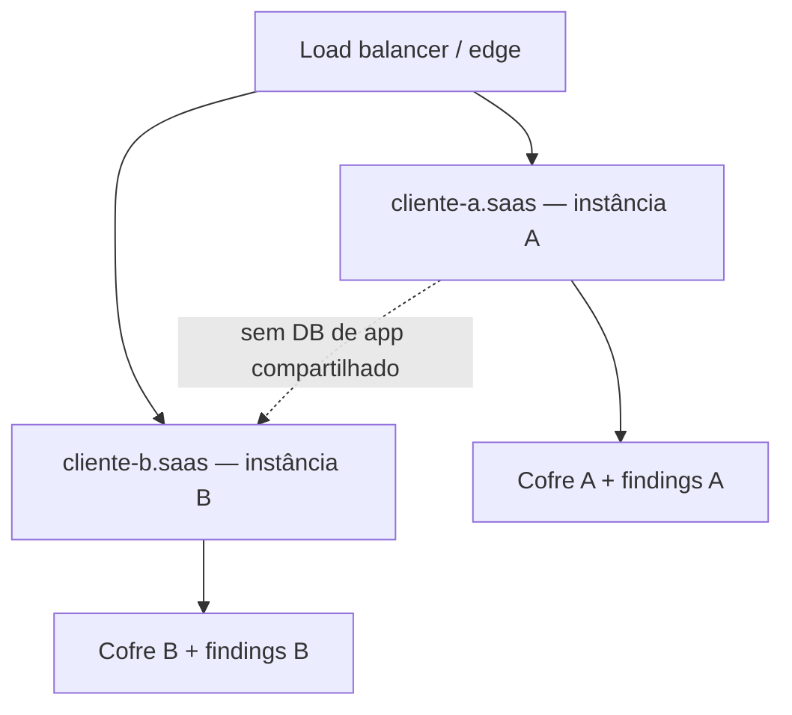

# Use case — Deployment gerenciado / SaaS multi-tenant

**English:** [USE_CASE_MANAGED_SAAS_MULTI_TENANT.md](USE_CASE_MANAGED_SAAS_MULTI_TENANT.md)

**Somente ilustrativo** — não é assessoria jurídica nem SLA de hospedagem. Air-gapped / on-prem continua sendo o **padrão recomendado**; gerenciado / SaaS é **opt-in** para quem prefere plano de controle hospedado.

**Ângulo adjacente (comprador diferente):** [MSP_IT_CONSULTANCY_MULTI_TENANT_SMB.pt_BR.md](MSP_IT_CONSULTANCY_MULTI_TENANT_SMB.pt_BR.md) — um MSP escaneia as **próprias** PMEs com playbooks repetíveis. Este use case é o **plano SaaS gerenciado que operamos** para uma organização cliente (um tenant = uma tenancy do cliente).

---

## Lacuna de mercado

> Queremos discovery sem levantar stack própria — e sem enviar dado bruto do cliente para uma caixa-preta multi-tenant compartilhada.

| Hoje (típico) | Com Data Boar gerenciado (este modelo) |
| ------------- | -------------------------------------- |
| Só DIY on-prem, ou SaaS compartilhado em que tenancy é “RBAC num único cluster” | Subdomínio → **instância dedicada** atrás de LB; runner BYO-cloud mantém o dado bruto na tenancy do cliente; findings voltam como **metadata de localização** |

---

## Isolamento por arquitetura (não só por RBAC)

**Padrão duro:** cada subdomínio de cliente (`<cliente>.<dominio-saas>`) aponta para **sua própria instância isolada** (VM ou container atrás de load balancer). Vazamento cross-tenant é **arquiteturalmente impossível** neste modelo — não apenas “bloqueado por RBAC”.

| Camada | Papel |
| ------ | ----- |
| **Subdomínio** | URL de entrada do operador/cliente escopada àquela tenancy |
| **Instância** | Compute + armazenamento + cofre de credenciais dedicados àquele tenant |
| **RBAC (dentro da instância)** | Quem pode ver quais alvos/relatórios **dentro** da instância daquele cliente |

**Posturas de RBAC (dentro de uma instância de cliente):**

| Postura de edição | Forma de RBAC (ilustrativo) |
| ----------------- | --------------------------- |
| **Pro** | Conjunto fixo de papéis |
| **Pro+** | Papéis customizados |
| **Enterprise** | Escopos por recurso + SSO |

**Opção futura de densidade (não é o padrão):** multi-tenancy em máquina compartilhada com RBAC forte e partições. Documentar como **evolução** de densidade; **não** apresentar como padrão gerenciado enquanto o GTM lidera com isolamento arquitetural.

---

## Colocação do runner

| Modo | Onde o scan roda | O que sai da tenancy do cliente |
| ---- | ---------------- | ------------------------------- |
| **BYO-cloud** | VM / compute **na cloud do próprio cliente** | **Só metadata de findings** (paths, tabelas, colunas, ids)—o **dado bruto nunca sai** da tenancy dele. O plano de controle pode permanecer hospedado. |
| **Hospedado** | Compute do provedor **efêmero e endurecido** | Mesmo contrato de metadata de findings; amostras brutas não devem persistir em swap, log ou dump |

**Postura no-retention:** o produto **lê → detecta → reporta findings (metadata de localização) → descarta o raw**. Findings são o **onde**, não o **quê** — ainda assim são confidenciais / sensíveis a recon e devem permanecer **isolados por tenant**.

---

## Por que um cliente escolheria

### Discrição / shadow-IT sem teatro de espionagem

CISO / DPO podem rodar discovery com menos fricção contra filas de ticket do IT interno, com visibilidade **RBAC-gated** e toda ação privilegiada no **Audit Trail** imutável. Isso é **mandato com discrição e auditabilidade** — não vigilância encoberta de colegas.

### Auditoria de alvos SaaS

Escanear serviços que a organização já opera na nuvem (exemplos: Google Workspace, HubSpot, HRIS) **via API desses fornecedores**, a partir do plano gerenciado, com **custódia de credencial por tenant** (abaixo).

### Diferencial global — multi-locale e multi-encoding de verdade

Deixar explícito para compradores e parceiros:

- **Bilíngue (e além) de propósito** — superfícies de produto e docs de operador suportam mais de um idioma; locales adicionais entram em **minutos**, não em rewrite de vários trimestres.
- **Locale + encoding reais** — detecção e reporting respeitam encodings e convenções de locale de fato, para a mesma plataforma servir **qualquer idioma de cliente** onde ele opere.
- É isso que torna defensável um modelo SaaS / consultoria **global** — não um scanner de um único locale com página de marketing traduzida.

---

## Custódia de credencial (por tenant)

Cada instância de tenant guarda **suas próprias** credenciais de conector:

- Menor privilégio / **somente leitura** quando a API do alvo permite
- Escopos mínimos
- Revogáveis
- Com **HSM** (ou cofre equivalente com respaldo em hardware) em posturas gerenciadas de produção

Roteamento por subdomínio **sozinho** não é a fronteira de segurança — a **instância dedicada + cofre + partição de findings** é.

---

## Notas de segurança (public-safe)

- Compute hospedado: **efêmero / endurecido**; PII não deve cair em swap, logs compartilhados ou dumps de crash.
- Isolamento de findings entre tenants continua obrigatório mesmo sendo metadata.
- Operadores do plano gerenciado veem só o que o RBAC **dentro** daquela instância de tenant permite; não há “lago god-mode” de findings compartilhado entre clientes no padrão de isolamento arquitetural.
- **Fora do escopo deste doc público:** preço, valuation, modelos de monetização — ficam em materiais comerciais privados, não em docs de produto rastreados.

---

## Como isso difere do storyboard MSP

| | [MSP multi-tenant PME](MSP_IT_CONSULTANCY_MULTI_TENANT_SMB.pt_BR.md) | Este use case SaaS gerenciado |
| --- | ------------------------------------------------------------------- | ----------------------------- |
| **Quem opera** | MSP / consultoria de TI escaneando **seus** clientes | Plano gerenciado operado pelo provedor para **uma tenancy de cliente** |
| **Metáfora de tenancy** | Muitas pastas / receitas no toolkit da consultoria | Um subdomínio → uma instância isolada |
| **Fricção típica** | Sangramento cross-client em laptop ou árvore de sync | Custódia de credencial, colocação do runner, no-retention |

---

## Documentos relacionados

- [USE_CASES_HUB.pt_BR.md](USE_CASES_HUB.pt_BR.md) ([EN](USE_CASES_HUB.md))
- [MSP_IT_CONSULTANCY_MULTI_TENANT_SMB.pt_BR.md](MSP_IT_CONSULTANCY_MULTI_TENANT_SMB.pt_BR.md) ([EN](MSP_IT_CONSULTANCY_MULTI_TENANT_SMB.md))
- [USE_CASE_SCAN_AND_REMEDIATE.pt_BR.md](USE_CASE_SCAN_AND_REMEDIATE.pt_BR.md) ([EN](USE_CASE_SCAN_AND_REMEDIATE.md))
- [USE_CASE_TOKENIZED_FINDINGS.pt_BR.md](USE_CASE_TOKENIZED_FINDINGS.pt_BR.md) ([EN](USE_CASE_TOKENIZED_FINDINGS.md))
- [DOCKER_SETUP.pt_BR.md](../DOCKER_SETUP.pt_BR.md) ([EN](../DOCKER_SETUP.md))
- [USAGE.pt_BR.md](../USAGE.pt_BR.md) ([EN](../USAGE.md))
- [DECISION_MAKER_VALUE_BRIEF.pt_BR.md](../DECISION_MAKER_VALUE_BRIEF.pt_BR.md) ([EN](../DECISION_MAKER_VALUE_BRIEF.md))
