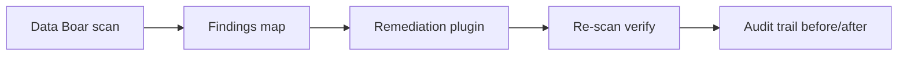

# Use case — Scan and remediate with audit trail

**Português (Brasil):** [USE_CASE_SCAN_AND_REMEDIATE.pt_BR.md](USE_CASE_SCAN_AND_REMEDIATE.pt_BR.md)

**Illustrative only** — not legal advice. Remediation plugins are **Enterprise-tier** integrations (maintainer plan: `docs/plans/PLAN_REMEDIATION_INTERFACE.md`, GitHub **#601**).

---

## Market gap

> The scanner shows where the problem is. Who fixes it—and how do we prove it was fixed?

| Today (typical) | With Data Boar + remediation plugin |
| ----------------- | ----------------------------------- |
| Scanner → report → manual cleanup → weak traceability | Scan → precise map → plugin remediates in place → re-scan → immutable audit trail |

---

## Pipeline

1. **Scan** — connectors discover PII/sensitive data (filesystem, SQL, APIs as configured).
1. **Map** — findings carry location (`table`, `column`, `row_id`, `path`, `pii_type`) for downstream tools.
1. **Remediate** — third-party plugin applies tokenization, masking, pseudonymization, or field encryption **at the mapped coordinates** (no full re-discovery pass required).
1. **Verify** — Data Boar re-scans scoped targets to confirm sensitive samples no longer appear as plaintext where expected.
1. **Evidence** — audit trail records scan id, remediation method, operator/plugin identity (as configured), and before/after references.

---

## Example scenarios

| Scenario | Data | Typical remediation method |
| -------- | ---- | -------------------------- |
| Legacy banking table | PAN, CVV in plaintext columns | Format-preserving tokenization (reversible where policy allows) |
| Hospital exports | National ID, date of birth in CSV/SQL | Irreversible pseudonymization |
| E-commerce debug logs | Email, name in log lines | Masking (`***@***.example`) |
| Time-and-attendance store | Biometric templates, employee IDs | Field encryption or vaultless tokenization via HSM-backed plugin |

---

## Forensic evidence (audit trail)

| Stage | What to record |
| ----- | -------------- |
| Initial scan | Scope, connector targets, finding ids, sample hashes (not necessarily raw PII in shared exports) |
| Remediation job | Plugin id, method, timestamp, operator/service principal |
| Re-scan | Pass/fail per finding id, delta summary |
| Export to auditor | Tokenized findings report where policy requires (see [USE_CASE_TOKENIZED_FINDINGS.md](USE_CASE_TOKENIZED_FINDINGS.md)) |

---

## Regulations often cited in workshops

- **LGPD** Arts. 46–47 — security measures and damage prevention
- **GDPR** Art. 25 — data protection by design and by default
- **PCI DSS** Req. 3 — protect stored account data
- **HIPAA** Security Rule — technical safeguards (US health contexts)

Counsel validates applicability per deployment.

---

## How to configure (product)

1. Ship **open-core** discovery and reporting per [USAGE.md](../USAGE.md).
1. Enable **Enterprise** remediation plugin hook when available (GitHub **#601** / **#606**; maintainer plan `docs/plans/PLAN_REMEDIATION_INTERFACE.md`).
1. Scope **re-scan** targets to the same roots as the initial scan for defensible before/after proof.

---

## Related docs

- [USE_CASES_HUB.md](USE_CASES_HUB.md) ([pt-BR](USE_CASES_HUB.pt_BR.md))
- [USE_CASE_TOKENIZED_FINDINGS.md](USE_CASE_TOKENIZED_FINDINGS.md) ([pt-BR](USE_CASE_TOKENIZED_FINDINGS.pt_BR.md))
- [REPORTS_AND_COMPLIANCE_OUTPUTS.md](../REPORTS_AND_COMPLIANCE_OUTPUTS.md) ([pt-BR](../REPORTS_AND_COMPLIANCE_OUTPUTS.pt_BR.md))
