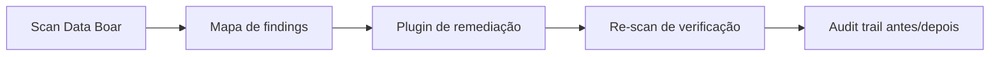

# Use case — Escanear e remediar com audit trail

**English:** [USE_CASE_SCAN_AND_REMEDIATE.md](USE_CASE_SCAN_AND_REMEDIATE.md)

**Somente ilustrativo** — não é assessoria jurídica. Plugins de remediação são integrações **Enterprise** (plano interno: `docs/plans/PLAN_REMEDIATION_INTERFACE.pt_BR.md`, GitHub **#601**).

---

## Lacuna de mercado

> O scanner mostra onde está o problema. Quem corrige — e como provamos que corrigiu?

| Hoje (típico) | Com Data Boar + plugin de remediação |
| ------------- | ------------------------------------ |
| Scanner → relatório → limpeza manual → rastreio fraco | Scan → mapa preciso → plugin remedeia no lugar → re-scan → audit trail imutável |

---

## Pipeline

1. **Scan** — conectores descobrem PII/dados sensíveis (filesystem, SQL, APIs conforme configuração).
1. **Mapa** — findings trazem localização (`table`, `column`, `row_id`, `path`, `pii_type`) para ferramentas downstream.
1. **Remediação** — plugin de terceiro aplica tokenização, masking, pseudonimização ou criptografia de campo **nas coordenadas mapeadas**.
1. **Verificação** — Data Boar re-escaneia alvos no escopo para confirmar que amostras sensíveis não aparecem mais em texto claro onde esperado.
1. **Evidência** — audit trail registra id do scan, método de remediação, identidade do plugin/operador (conforme config) e referências antes/depois.

---

## Cenários de exemplo

| Cenário | Dado | Método típico de remediação |
| ------- | ---- | --------------------------- |
| Tabela legada em banco | PAN, CVV em colunas plaintext | Tokenização format-preserving (reversível quando a política permitir) |
| Export hospitalar | ID nacional, data de nascimento em CSV/SQL | Pseudonimização irreversível |
| Logs de debug em e-commerce | E-mail, nome em linhas de log | Masking (`***@***.example`) |
| Ponto eletrônico | Templates biométricos, matrícula | Criptografia de campo ou tokenização via plugin com HSM |

---

## Evidência forense (audit trail)

| Etapa | O que registrar |
| ----- | ----------------- |
| Scan inicial | Escopo, alvos dos conectores, ids de finding, hashes de amostra (sem PII bruta em export compartilhado) |
| Job de remediação | Id do plugin, método, timestamp, operador/service principal |
| Re-scan | Pass/fail por finding id, resumo do delta |
| Export para auditor | Relatório tokenizado quando a política exigir (veja [USE_CASE_TOKENIZED_FINDINGS.pt_BR.md](USE_CASE_TOKENIZED_FINDINGS.pt_BR.md)) |

---

## Regulações citadas em workshops

- **LGPD** arts. 46–47 — medidas de segurança e prevenção de danos
- **GDPR** art. 25 — proteção de dados desde a concepção e por padrão
- **PCI DSS** Req. 3 — proteger dados de cartão armazenados
- **HIPAA** Security Rule — salvaguardas técnicas (contexto de saúde nos EUA)

O jurídico valida aplicabilidade por deployment.

---

## Como configurar (produto)

1. Entregue discovery e reporting **open-core** conforme [USAGE.pt_BR.md](../USAGE.pt_BR.md).
1. Habilite o hook de plugin **Enterprise** quando disponível (GitHub **#601** / **#606**; plano `docs/plans/PLAN_REMEDIATION_INTERFACE.pt_BR.md`).
1. Escopo do **re-scan** igual ao do scan inicial para prova antes/depois defensável.

---

## Documentos relacionados

- [USE_CASES_HUB.pt_BR.md](USE_CASES_HUB.pt_BR.md)
- [USE_CASE_TOKENIZED_FINDINGS.pt_BR.md](USE_CASE_TOKENIZED_FINDINGS.pt_BR.md)
- [REPORTS_AND_COMPLIANCE_OUTPUTS.pt_BR.md](../REPORTS_AND_COMPLIANCE_OUTPUTS.pt_BR.md)
